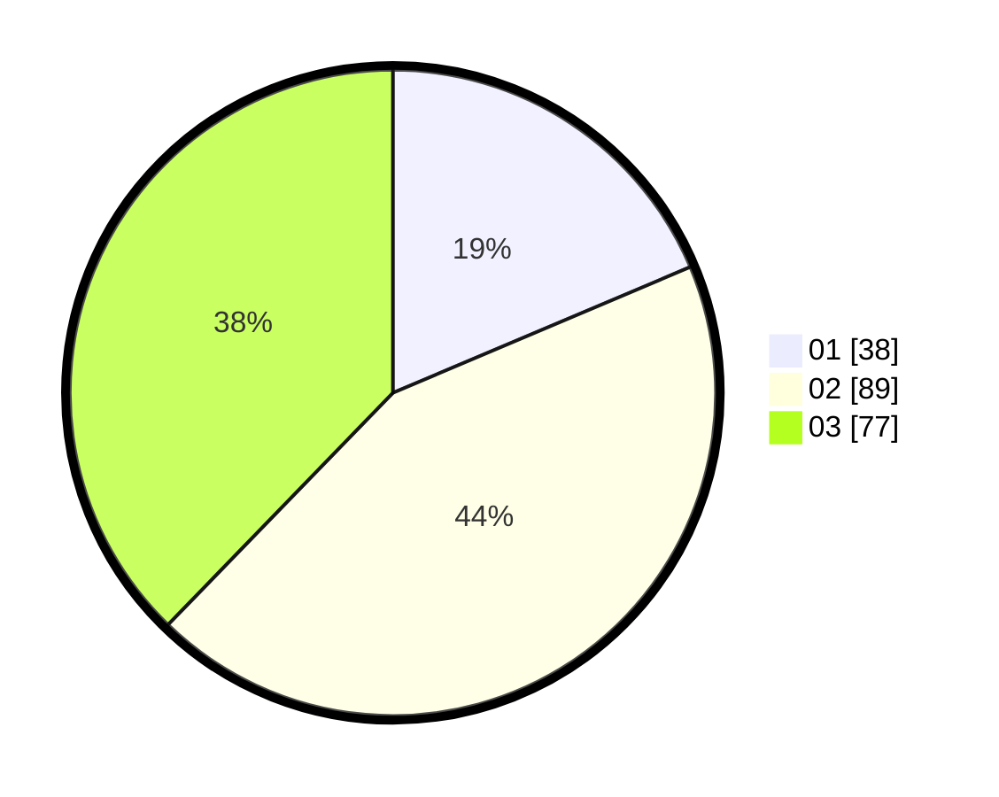

# Hasil

Hasil perolehan suara paslon dapat dilihat pada file paslon-01.txt, paslon-02.txt, dan paslon-03.txt.

Jika tidak ada, artinya data tersebut belum ada pada SIREKAP.

## Perolehan Suara

 * Paslon 01: **38**.
 * Paslon 02: **89**.
 * Paslon 03: **77**.

## Foto C Plano

https://sirekap-obj-formc.kpu.go.id/27e2/pemilu/ppwp/31/73/04/10/04/3173041004076-20240214-225457--a2ab2984-81e7-4af7-ae77-2eac127780f2.jpg

https://sirekap-obj-formc.kpu.go.id/27e2/pemilu/ppwp/31/73/04/10/04/3173041004076-20240214-225531--0cc48f8f-4a3c-4c6c-8288-b6d76f6ad92a.jpg

https://sirekap-obj-formc.kpu.go.id/27e2/pemilu/ppwp/31/73/04/10/04/3173041004076-20240214-225608--65097f04-3e2d-4075-b2c8-a45a3e85804d.jpg
