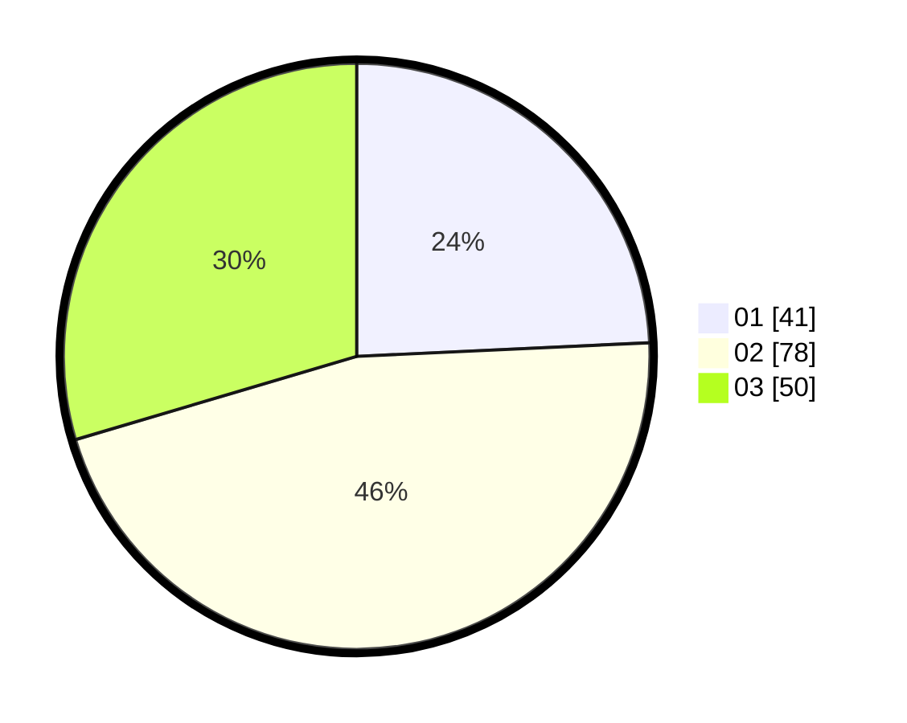

# Hasil

Hasil perolehan suara paslon dapat dilihat pada file paslon-01.txt, paslon-02.txt, dan paslon-03.txt.

Jika tidak ada, artinya data tersebut belum ada pada SIREKAP.

## Perolehan Suara

 * Paslon 01: **41**.
 * Paslon 02: **78**.
 * Paslon 03: **50**.

## Foto C Plano

https://sirekap-obj-formc.kpu.go.id/2419/pemilu/ppwp/31/73/04/10/04/3173041004079-20240214-185645--9a968706-8e04-4d5e-8be4-11e44f6a8aa8.jpg

https://sirekap-obj-formc.kpu.go.id/2419/pemilu/ppwp/31/73/04/10/04/3173041004079-20240214-162226--a9b55d73-7995-43d9-b9c2-63519cfb1918.jpg
