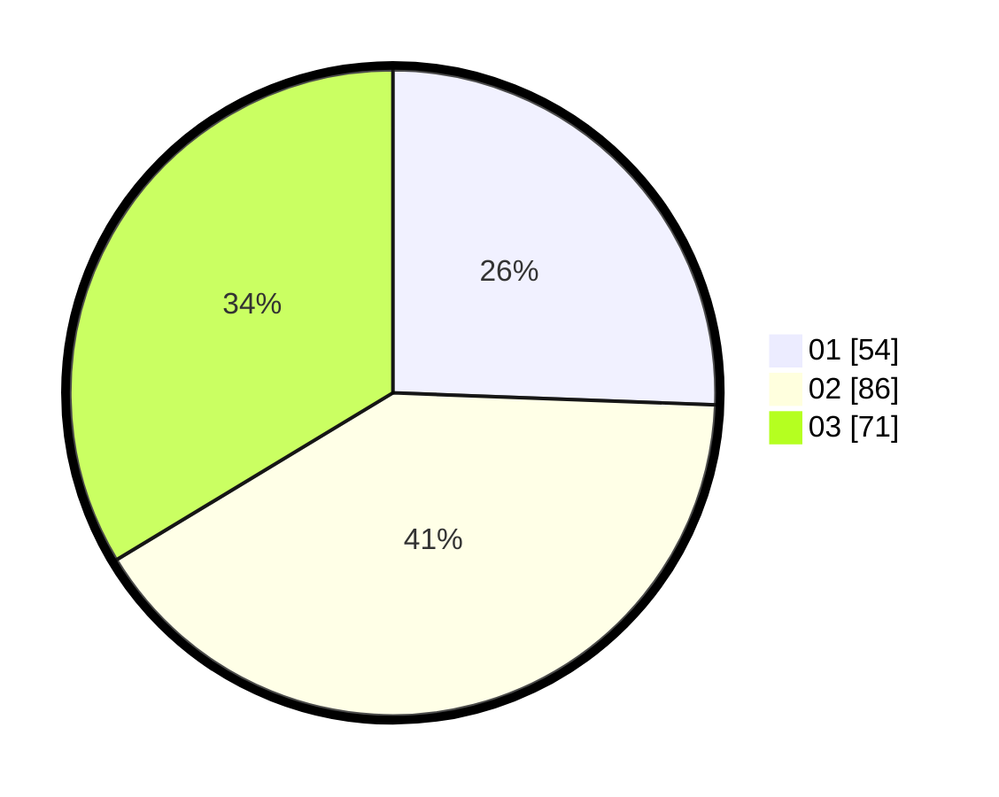

# Hasil

Hasil perolehan suara paslon dapat dilihat pada file paslon-01.txt, paslon-02.txt, dan paslon-03.txt.

Jika tidak ada, artinya data tersebut belum ada pada SIREKAP.

## Perolehan Suara

 * Paslon 01: **54**.
 * Paslon 02: **86**.
 * Paslon 03: **71**.

## Foto C Plano

https://sirekap-obj-formc.kpu.go.id/cf1e/pemilu/ppwp/31/73/04/10/04/3173041004083-20240215-031650--64fd86f6-f335-4e70-8d2c-e606accc1c21.jpg

https://sirekap-obj-formc.kpu.go.id/cf1e/pemilu/ppwp/31/73/04/10/04/3173041004083-20240215-031806--cf38cb18-da7b-4677-a480-415a833bd288.jpg

https://sirekap-obj-formc.kpu.go.id/cf1e/pemilu/ppwp/31/73/04/10/04/3173041004083-20240215-031847--e20e53ec-a940-4b8e-94ec-90d7633ef883.jpg
