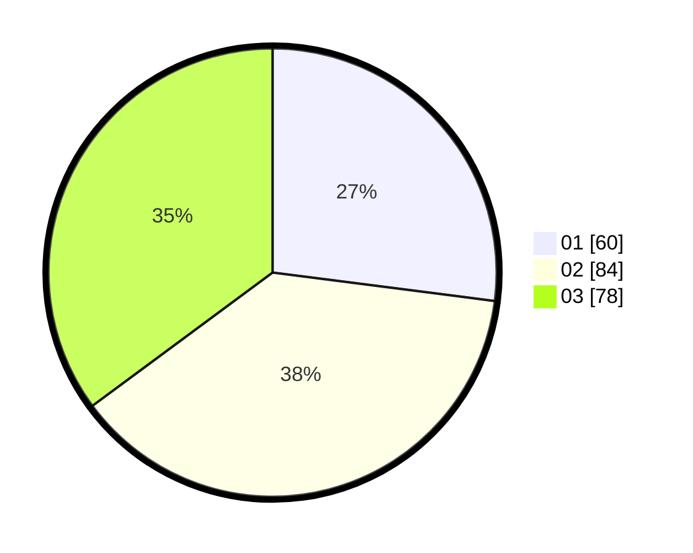

# Hasil

Hasil perolehan suara paslon dapat dilihat pada file paslon-01.txt, paslon-02.txt, dan paslon-03.txt.

Jika tidak ada, artinya data tersebut belum ada pada SIREKAP.

## Perolehan Suara

 * Paslon 01: **60**.
 * Paslon 02: **84**.
 * Paslon 03: **78**.

## Foto C Plano

https://sirekap-obj-formc.kpu.go.id/b6be/pemilu/ppwp/31/73/04/10/04/3173041004085-20240214-222535--1e539fe5-f09b-4d2f-acf4-40ab8fd32a78.jpg

https://sirekap-obj-formc.kpu.go.id/b6be/pemilu/ppwp/31/73/04/10/04/3173041004085-20240214-222143--efe2394a-7951-4146-bbfc-17c14dc63b02.jpg

https://sirekap-obj-formc.kpu.go.id/b6be/pemilu/ppwp/31/73/04/10/04/3173041004085-20240214-222817--670cc96c-d4d7-4cc8-b3e0-416dd863448a.jpg
