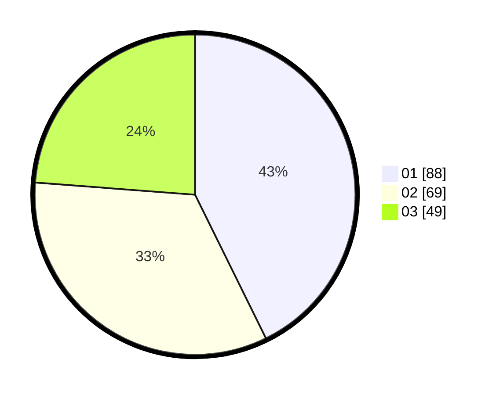

# Hasil

Hasil perolehan suara paslon dapat dilihat pada file paslon-01.txt, paslon-02.txt, dan paslon-03.txt.

Jika tidak ada, artinya data tersebut belum ada pada SIREKAP.

## Perolehan Suara

 * Paslon 01: **88**.
 * Paslon 02: **69**.
 * Paslon 03: **49**.

## Foto C Plano

https://sirekap-obj-formc.kpu.go.id/4d07/pemilu/ppwp/31/73/04/10/04/3173041004086-20240214-185239--b908e93b-782f-4867-8d68-a40427db2ec6.jpg

https://sirekap-obj-formc.kpu.go.id/4d07/pemilu/ppwp/31/73/04/10/04/3173041004086-20240214-185701--75422aa4-db9f-462e-9d41-49ca356ff4c5.jpg

https://sirekap-obj-formc.kpu.go.id/4d07/pemilu/ppwp/31/73/04/10/04/3173041004086-20240214-185843--96c3da9c-316d-4449-8fab-1e6f358ce0a0.jpg

## DATA PEMILIH TETAP

Jumlah pemilih dalam DPT: **273**.
 * L: **131**.
 * P: **142**.

## DATA PENGGUNA HAK PILIH

Jumlah pengguna hak pilih dalam DPT: **209**.
 * L: **94**.
 * P: **115**.

Jumlah pengguna hak pilih dalam DPTb: **1**.
 * L: **0**.
 * P: **1**.

Jumlah pengguna hak pilih dalam DPK: **1**.
 * L: **0**.
 * P: **1**.

Jumlah pengguna hak pilih: **211**.
 * L: **94**.
 * P: **117**.

## JUMLAH SUARA SAH DAN TIDAK SAH

JUMLAH SELURUH SUARA SAH: **206**.

JUMLAH SUARA TIDAK SAH: **5**.

JUMLAH SELURUH SUARA SAH DAN SUARA TIDAK SAH: **211**.
