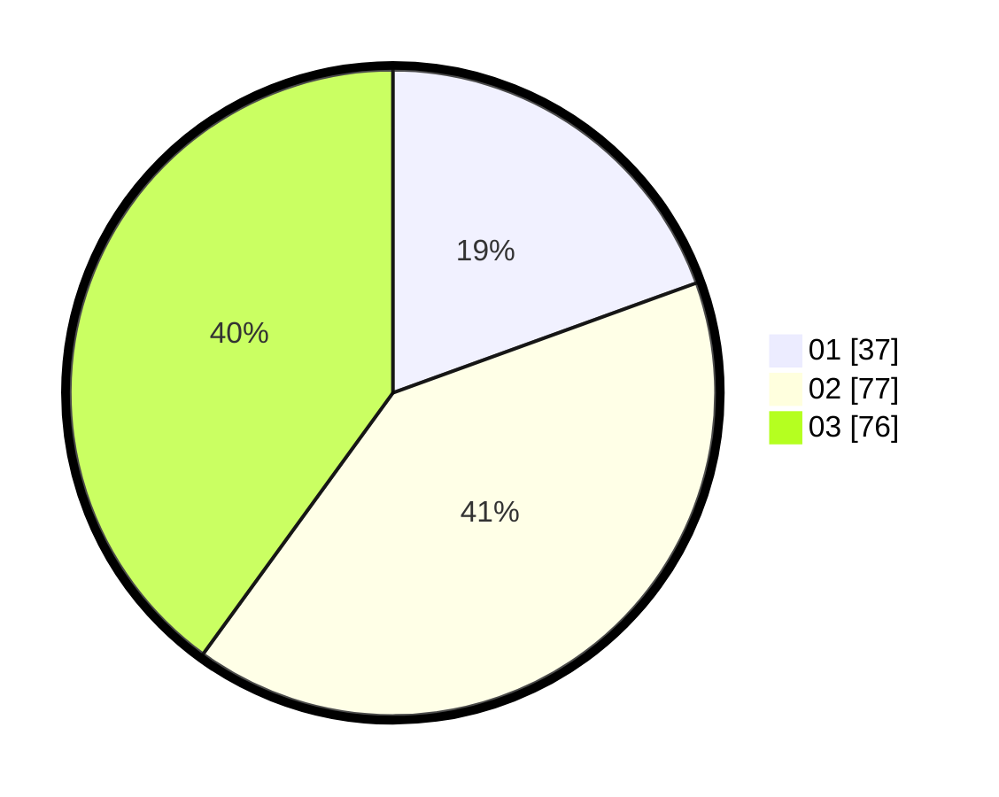

# Hasil

Hasil perolehan suara paslon dapat dilihat pada file paslon-01.txt, paslon-02.txt, dan paslon-03.txt.

Jika tidak ada, artinya data tersebut belum ada pada SIREKAP.

## Perolehan Suara

 * Paslon 01: **37**.
 * Paslon 02: **77**.
 * Paslon 03: **76**.

## Foto C Plano

https://sirekap-obj-formc.kpu.go.id/8f54/pemilu/ppwp/31/73/04/10/04/3173041004087-20240214-141741--e73d839c-9c35-4f36-9758-9eb7cf675c9e.jpg

https://sirekap-obj-formc.kpu.go.id/8f54/pemilu/ppwp/31/73/04/10/04/3173041004087-20240214-141838--e6768df1-36e9-4151-a28d-6096a00499e6.jpg

https://sirekap-obj-formc.kpu.go.id/8f54/pemilu/ppwp/31/73/04/10/04/3173041004087-20240214-141500--055362ac-0f6e-401b-afaa-2650c00e485b.jpg
