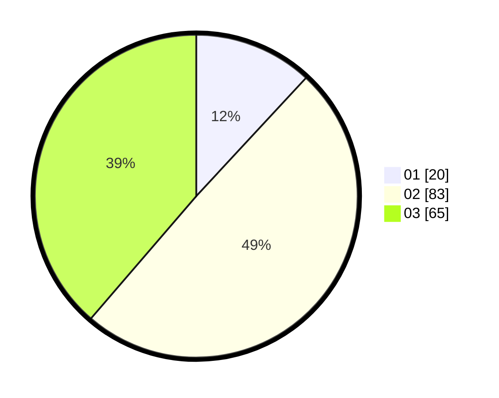

# Hasil

Hasil perolehan suara paslon dapat dilihat pada file paslon-01.txt, paslon-02.txt, dan paslon-03.txt.

Jika tidak ada, artinya data tersebut belum ada pada SIREKAP.

## Perolehan Suara

 * Paslon 01: **20**.
 * Paslon 02: **83**.
 * Paslon 03: **65**.

## Foto C Plano

https://sirekap-obj-formc.kpu.go.id/787f/pemilu/ppwp/31/73/04/10/05/3173041005002-20240214-213803--266ec4ab-b525-423d-beb1-d475a1999295.jpg

https://sirekap-obj-formc.kpu.go.id/787f/pemilu/ppwp/31/73/04/10/05/3173041005002-20240214-201507--0702d204-c62a-4256-92e7-c1d5053177a6.jpg

https://sirekap-obj-formc.kpu.go.id/787f/pemilu/ppwp/31/73/04/10/05/3173041005002-20240214-201510--1c9d394d-d183-489d-bd5c-9876d0cd82ca.jpg

## DATA PEMILIH TETAP

Jumlah pemilih dalam DPT: **275**.
 * L: **143**.
 * P: **132**.

## DATA PENGGUNA HAK PILIH

Jumlah pengguna hak pilih dalam DPT: **168**.
 * L: **82**.
 * P: **86**.

Jumlah pengguna hak pilih dalam DPTb: **0**.
 * L: **0**.
 * P: **0**.

Jumlah pengguna hak pilih dalam DPK: **0**.
 * L: **0**.
 * P: **0**.

Jumlah pengguna hak pilih: **168**.
 * L: **82**.
 * P: **86**.

## JUMLAH SUARA SAH DAN TIDAK SAH

JUMLAH SELURUH SUARA SAH: **168**.

JUMLAH SUARA TIDAK SAH: **0**.

JUMLAH SELURUH SUARA SAH DAN SUARA TIDAK SAH: **168**.
