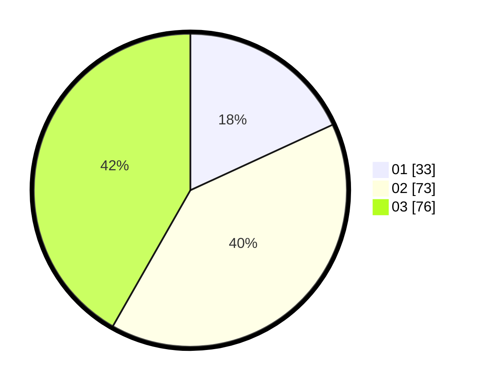

# Hasil

Hasil perolehan suara paslon dapat dilihat pada file paslon-01.txt, paslon-02.txt, dan paslon-03.txt.

Jika tidak ada, artinya data tersebut belum ada pada SIREKAP.

## Perolehan Suara

 * Paslon 01: **33**.
 * Paslon 02: **73**.
 * Paslon 03: **76**.

## Foto C Plano

https://sirekap-obj-formc.kpu.go.id/fd14/pemilu/ppwp/31/73/04/10/05/3173041005005-20240214-212302--d287dd13-e14d-47d9-96a6-f27f8809cb95.jpg

https://sirekap-obj-formc.kpu.go.id/fd14/pemilu/ppwp/31/73/04/10/05/3173041005005-20240214-212351--41a1ee39-d90c-4e97-b72a-fcad7af4eb69.jpg

https://sirekap-obj-formc.kpu.go.id/fd14/pemilu/ppwp/31/73/04/10/05/3173041005005-20240214-212415--c54d49d5-de07-4c49-80ba-268030ca4174.jpg

## DATA PEMILIH TETAP

Jumlah pemilih dalam DPT: **280**.
 * L: **136**.
 * P: **144**.

## DATA PENGGUNA HAK PILIH

Jumlah pengguna hak pilih dalam DPT: **188**.
 * L: **89**.
 * P: **99**.

Jumlah pengguna hak pilih dalam DPTb: **1**.
 * L: **0**.
 * P: **1**.

Jumlah pengguna hak pilih dalam DPK: **1**.
 * L: **0**.
 * P: **1**.

Jumlah pengguna hak pilih: **190**.
 * L: **89**.
 * P: **101**.

## JUMLAH SUARA SAH DAN TIDAK SAH

JUMLAH SELURUH SUARA SAH: **182**.

JUMLAH SUARA TIDAK SAH: **8**.

JUMLAH SELURUH SUARA SAH DAN SUARA TIDAK SAH: **190**.
