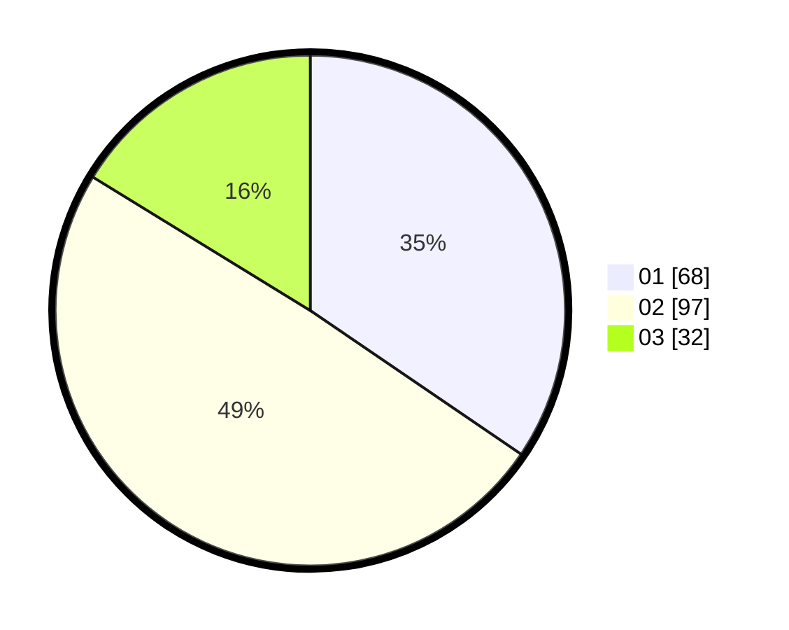

# Hasil

Hasil perolehan suara paslon dapat dilihat pada file paslon-01.txt, paslon-02.txt, dan paslon-03.txt.

Jika tidak ada, artinya data tersebut belum ada pada SIREKAP.

## Perolehan Suara

 * Paslon 01: **68**.
 * Paslon 02: **97**.
 * Paslon 03: **32**.

## Foto C Plano

https://sirekap-obj-formc.kpu.go.id/fba8/pemilu/ppwp/31/73/04/10/05/3173041005009-20240216-014426--96e02066-2421-43f6-a647-55caa3c4b964.jpg

https://sirekap-obj-formc.kpu.go.id/fba8/pemilu/ppwp/31/73/04/10/05/3173041005009-20240216-014427--d70b9741-c3e8-4311-9f6f-4c3ee627b035.jpg

https://sirekap-obj-formc.kpu.go.id/fba8/pemilu/ppwp/31/73/04/10/05/3173041005009-20240216-014426--ae6d790a-6912-4700-9236-fb91f3d00d2c.jpg

## DATA PEMILIH TETAP

Jumlah pemilih dalam DPT: **274**.
 * L: **136**.
 * P: **138**.

## DATA PENGGUNA HAK PILIH

Jumlah pengguna hak pilih dalam DPT: **200**.
 * L: **103**.
 * P: **97**.

Jumlah pengguna hak pilih dalam DPTb: **1**.
 * L: **1**.
 * P: **0**.

Jumlah pengguna hak pilih dalam DPK: **1**.
 * L: **1**.
 * P: **0**.

Jumlah pengguna hak pilih: **202**.
 * L: **105**.
 * P: **97**.

## JUMLAH SUARA SAH DAN TIDAK SAH

JUMLAH SELURUH SUARA SAH: **197**.

JUMLAH SUARA TIDAK SAH: **5**.

JUMLAH SELURUH SUARA SAH DAN SUARA TIDAK SAH: **202**.
