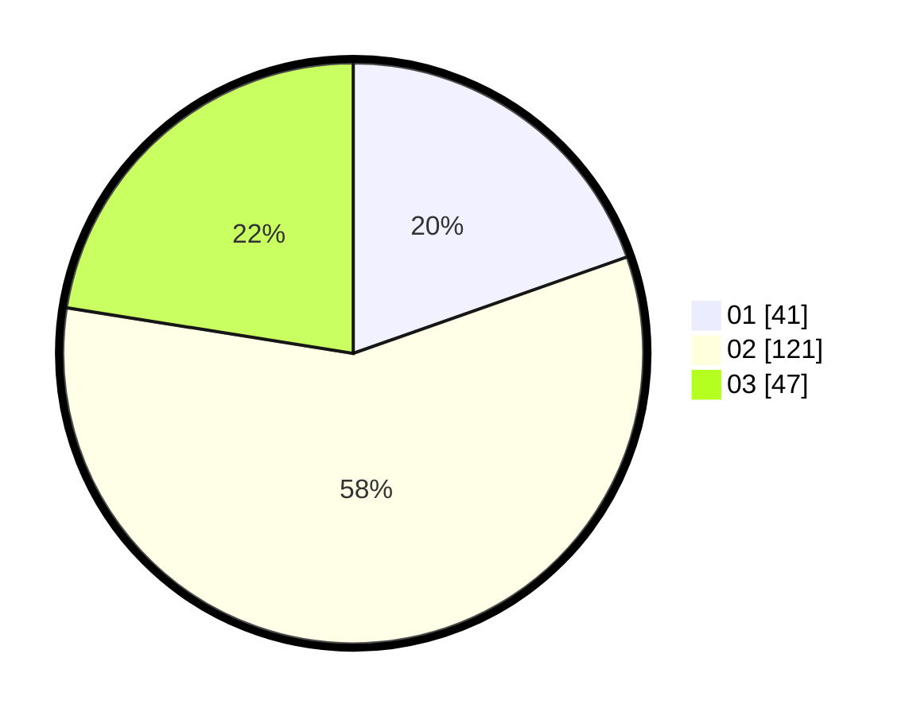

# Hasil

Hasil perolehan suara paslon dapat dilihat pada file paslon-01.txt, paslon-02.txt, dan paslon-03.txt.

Jika tidak ada, artinya data tersebut belum ada pada SIREKAP.

## Perolehan Suara

 * Paslon 01: **41**.
 * Paslon 02: **121**.
 * Paslon 03: **47**.

## Foto C Plano

https://sirekap-obj-formc.kpu.go.id/691b/pemilu/ppwp/31/73/04/10/05/3173041005010-20240215-050931--865fe4cb-f21d-438d-92d4-47fcb6390ce5.jpg

https://sirekap-obj-formc.kpu.go.id/691b/pemilu/ppwp/31/73/04/10/05/3173041005010-20240215-050309--a03271c1-0947-4cad-9dd5-b28d463a181e.jpg
