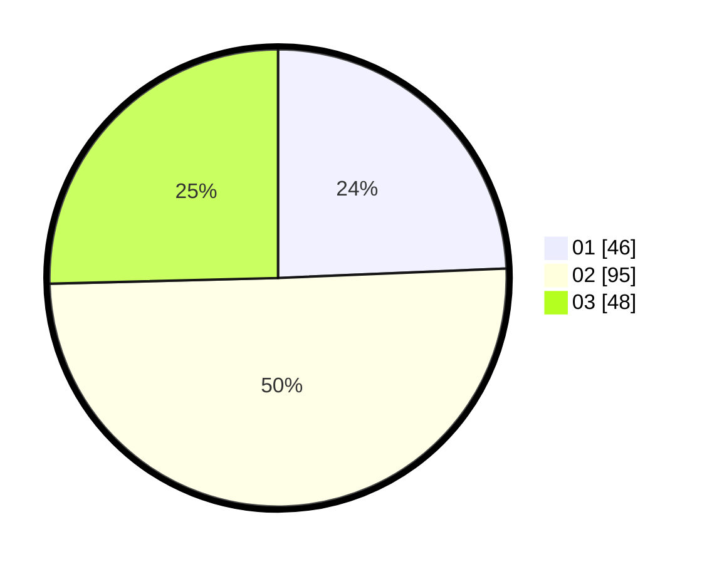

# Hasil

Hasil perolehan suara paslon dapat dilihat pada file paslon-01.txt, paslon-02.txt, dan paslon-03.txt.

Jika tidak ada, artinya data tersebut belum ada pada SIREKAP.

## Perolehan Suara

 * Paslon 01: **46**.
 * Paslon 02: **95**.
 * Paslon 03: **48**.

## Foto C Plano

https://sirekap-obj-formc.kpu.go.id/3f79/pemilu/ppwp/31/73/04/10/05/3173041005019-20240216-071955--4f85ba43-c28a-4f52-a415-7adc119f27b6.jpg

https://sirekap-obj-formc.kpu.go.id/3f79/pemilu/ppwp/31/73/04/10/05/3173041005019-20240216-071956--28a72f61-0afa-4550-8859-30b5ee676379.jpg

https://sirekap-obj-formc.kpu.go.id/3f79/pemilu/ppwp/31/73/04/10/05/3173041005019-20240216-071956--4c502e7b-44d7-4c7a-b1a2-7ca9b0ecde79.jpg

## DATA PEMILIH TETAP

Jumlah pemilih dalam DPT: **271**.
 * L: **148**.
 * P: **123**.

## DATA PENGGUNA HAK PILIH

Jumlah pengguna hak pilih dalam DPT: **191**.
 * L: **104**.
 * P: **87**.

Jumlah pengguna hak pilih dalam DPTb: **2**.
 * L: **0**.
 * P: **2**.

Jumlah pengguna hak pilih dalam DPK: **0**.
 * L: **0**.
 * P: **0**.

Jumlah pengguna hak pilih: **193**.
 * L: **104**.
 * P: **89**.

## JUMLAH SUARA SAH DAN TIDAK SAH

JUMLAH SELURUH SUARA SAH: **189**.

JUMLAH SUARA TIDAK SAH: **4**.

JUMLAH SELURUH SUARA SAH DAN SUARA TIDAK SAH: **193**.
