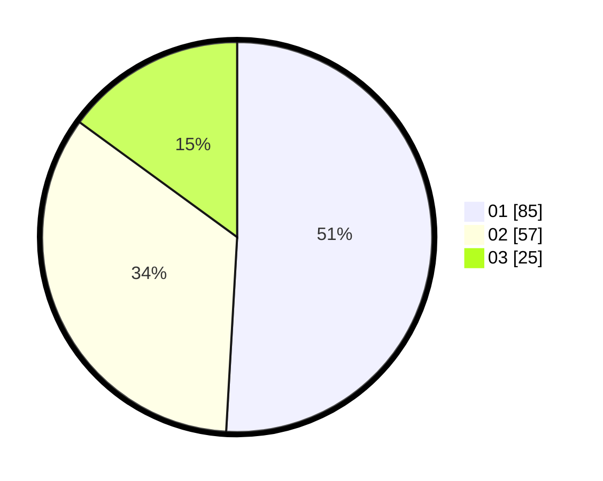

# Hasil

Hasil perolehan suara paslon dapat dilihat pada file paslon-01.txt, paslon-02.txt, dan paslon-03.txt.

Jika tidak ada, artinya data tersebut belum ada pada SIREKAP.

## Perolehan Suara

 * Paslon 01: **85**.
 * Paslon 02: **57**.
 * Paslon 03: **25**.

## Foto C Plano

https://sirekap-obj-formc.kpu.go.id/751f/pemilu/ppwp/31/73/04/10/05/3173041005023-20240216-005618--a4dac63f-57c0-481c-b46a-c6f3996ea4a5.jpg

https://sirekap-obj-formc.kpu.go.id/751f/pemilu/ppwp/31/73/04/10/05/3173041005023-20240216-005625--8babc696-277a-4b0c-9d76-7ed9aeb1d25b.jpg

https://sirekap-obj-formc.kpu.go.id/751f/pemilu/ppwp/31/73/04/10/05/3173041005023-20240214-155746--638f774c-2512-47c4-8146-4a6c6fe89706.jpg

## DATA PEMILIH TETAP

Jumlah pemilih dalam DPT: **260**.
 * L: **135**.
 * P: **125**.

## DATA PENGGUNA HAK PILIH

Jumlah pengguna hak pilih dalam DPT: **167**.
 * L: **79**.
 * P: **88**.

Jumlah pengguna hak pilih dalam DPTb: **1**.
 * L: **1**.
 * P: **0**.

Jumlah pengguna hak pilih dalam DPK: **2**.
 * L: **1**.
 * P: **1**.

Jumlah pengguna hak pilih: **170**.
 * L: **81**.
 * P: **89**.

## JUMLAH SUARA SAH DAN TIDAK SAH

JUMLAH SELURUH SUARA SAH: **167**.

JUMLAH SUARA TIDAK SAH: **3**.

JUMLAH SELURUH SUARA SAH DAN SUARA TIDAK SAH: **170**.
