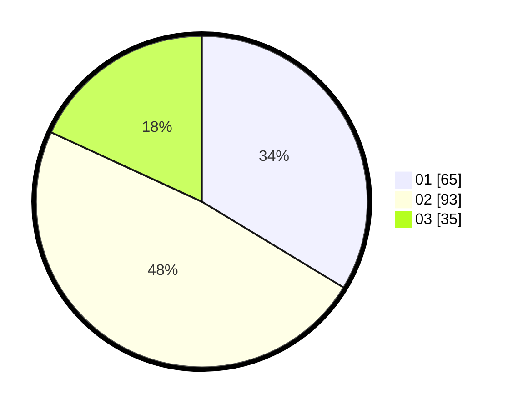

# Hasil

Hasil perolehan suara paslon dapat dilihat pada file paslon-01.txt, paslon-02.txt, dan paslon-03.txt.

Jika tidak ada, artinya data tersebut belum ada pada SIREKAP.

## Perolehan Suara

 * Paslon 01: **65**.
 * Paslon 02: **93**.
 * Paslon 03: **35**.

## Foto C Plano

https://sirekap-obj-formc.kpu.go.id/e41c/pemilu/ppwp/31/73/04/10/05/3173041005030-20240216-192345--1f34ccf3-d573-4217-8db1-6686b25dfc6f.jpg

https://sirekap-obj-formc.kpu.go.id/e41c/pemilu/ppwp/31/73/04/10/05/3173041005030-20240216-192346--ece3e1f7-9022-4cb1-9da4-4c8a071865f4.jpg

https://sirekap-obj-formc.kpu.go.id/e41c/pemilu/ppwp/31/73/04/10/05/3173041005030-20240216-192345--a9aca785-8a43-47a9-8c0c-980b859f10f0.jpg

## DATA PEMILIH TETAP

Jumlah pemilih dalam DPT: **260**.
 * L: **139**.
 * P: **121**.

## DATA PENGGUNA HAK PILIH

Jumlah pengguna hak pilih dalam DPT: **194**.
 * L: **108**.
 * P: **86**.

Jumlah pengguna hak pilih dalam DPTb: **0**.
 * L: **0**.
 * P: **0**.

Jumlah pengguna hak pilih dalam DPK: **0**.
 * L: **0**.
 * P: **0**.

Jumlah pengguna hak pilih: **194**.
 * L: **108**.
 * P: **86**.

## JUMLAH SUARA SAH DAN TIDAK SAH

JUMLAH SELURUH SUARA SAH: **193**.

JUMLAH SUARA TIDAK SAH: **1**.

JUMLAH SELURUH SUARA SAH DAN SUARA TIDAK SAH: **194**.
