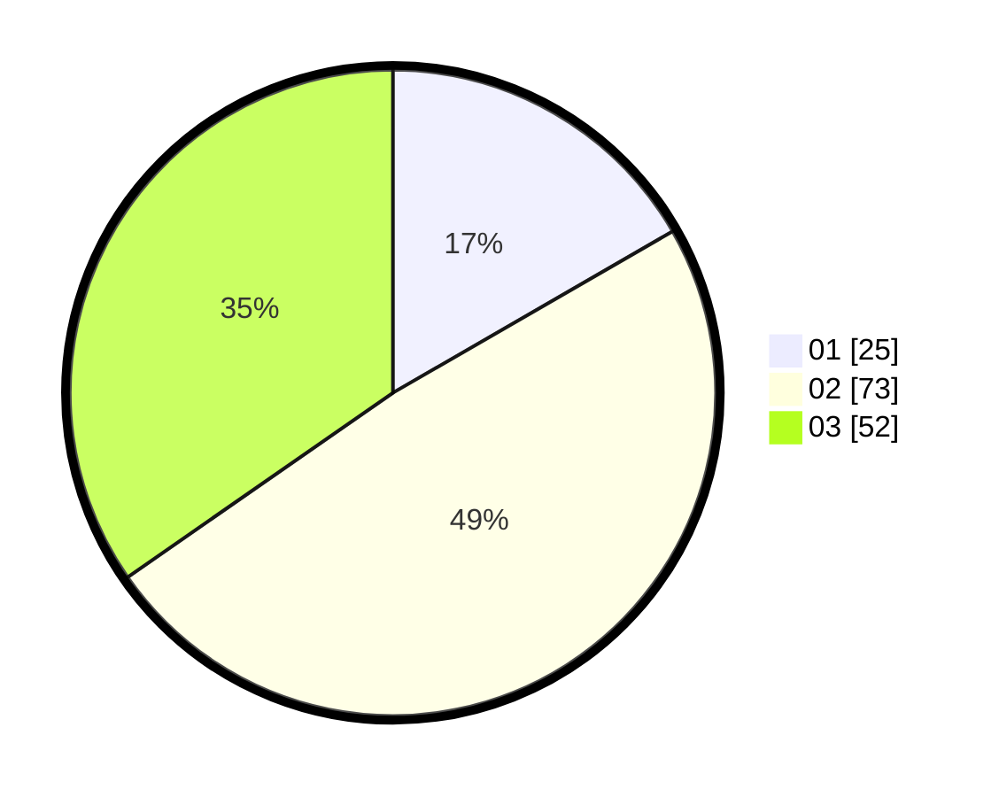

# Hasil

Hasil perolehan suara paslon dapat dilihat pada file paslon-01.txt, paslon-02.txt, dan paslon-03.txt.

Jika tidak ada, artinya data tersebut belum ada pada SIREKAP.

## Perolehan Suara

 * Paslon 01: **25**.
 * Paslon 02: **73**.
 * Paslon 03: **52**.

## Foto C Plano

https://sirekap-obj-formc.kpu.go.id/1796/pemilu/ppwp/31/73/04/10/05/3173041005032-20240215-213732--2273ddc2-437d-4995-ab1d-49461240c683.jpg

https://sirekap-obj-formc.kpu.go.id/1796/pemilu/ppwp/31/73/04/10/05/3173041005032-20240214-155659--49113a22-eade-43b5-981f-7dce7d4cabdf.jpg

https://sirekap-obj-formc.kpu.go.id/1796/pemilu/ppwp/31/73/04/10/05/3173041005032-20240214-155704--296f4c6c-1b52-40e5-8af7-038a4998d6bf.jpg

## DATA PEMILIH TETAP

Jumlah pemilih dalam DPT: **262**.
 * L: **136**.
 * P: **126**.

## DATA PENGGUNA HAK PILIH

Jumlah pengguna hak pilih dalam DPT: **145**.
 * L: **71**.
 * P: **74**.

Jumlah pengguna hak pilih dalam DPTb: **0**.
 * L: **0**.
 * P: **0**.

Jumlah pengguna hak pilih dalam DPK: **7**.
 * L: **4**.
 * P: **3**.

Jumlah pengguna hak pilih: **152**.
 * L: **75**.
 * P: **77**.

## JUMLAH SUARA SAH DAN TIDAK SAH

JUMLAH SELURUH SUARA SAH: **150**.

JUMLAH SUARA TIDAK SAH: **2**.

JUMLAH SELURUH SUARA SAH DAN SUARA TIDAK SAH: **152**.
