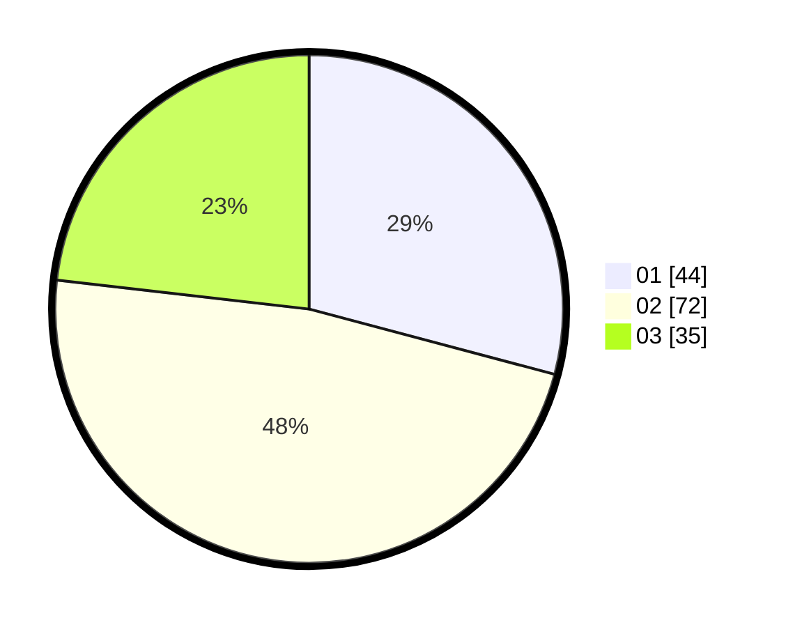

# Hasil

Hasil perolehan suara paslon dapat dilihat pada file paslon-01.txt, paslon-02.txt, dan paslon-03.txt.

Jika tidak ada, artinya data tersebut belum ada pada SIREKAP.

## Perolehan Suara

 * Paslon 01: **44**.
 * Paslon 02: **72**.
 * Paslon 03: **35**.

## Foto C Plano

https://sirekap-obj-formc.kpu.go.id/1470/pemilu/ppwp/31/73/04/10/05/3173041005033-20240216-005505--9328c7f4-c27a-43a9-8732-1deee18b4b10.jpg

https://sirekap-obj-formc.kpu.go.id/1470/pemilu/ppwp/31/73/04/10/05/3173041005033-20240216-005347--ba6a1ee6-976b-44f5-8fad-16e106f4cfeb.jpg

https://sirekap-obj-formc.kpu.go.id/1470/pemilu/ppwp/31/73/04/10/05/3173041005033-20240216-005344--4f882827-5879-4e9e-b86e-06f0d81d855b.jpg

## DATA PEMILIH TETAP

Jumlah pemilih dalam DPT: **260**.
 * L: **140**.
 * P: **120**.

## DATA PENGGUNA HAK PILIH

Jumlah pengguna hak pilih dalam DPT: **146**.
 * L: **80**.
 * P: **66**.

Jumlah pengguna hak pilih dalam DPTb: **2**.
 * L: **1**.
 * P: **1**.

Jumlah pengguna hak pilih dalam DPK: **5**.
 * L: **1**.
 * P: **4**.

Jumlah pengguna hak pilih: **153**.
 * L: **82**.
 * P: **71**.

## JUMLAH SUARA SAH DAN TIDAK SAH

JUMLAH SELURUH SUARA SAH: **151**.

JUMLAH SUARA TIDAK SAH: **2**.

JUMLAH SELURUH SUARA SAH DAN SUARA TIDAK SAH: **153**.
