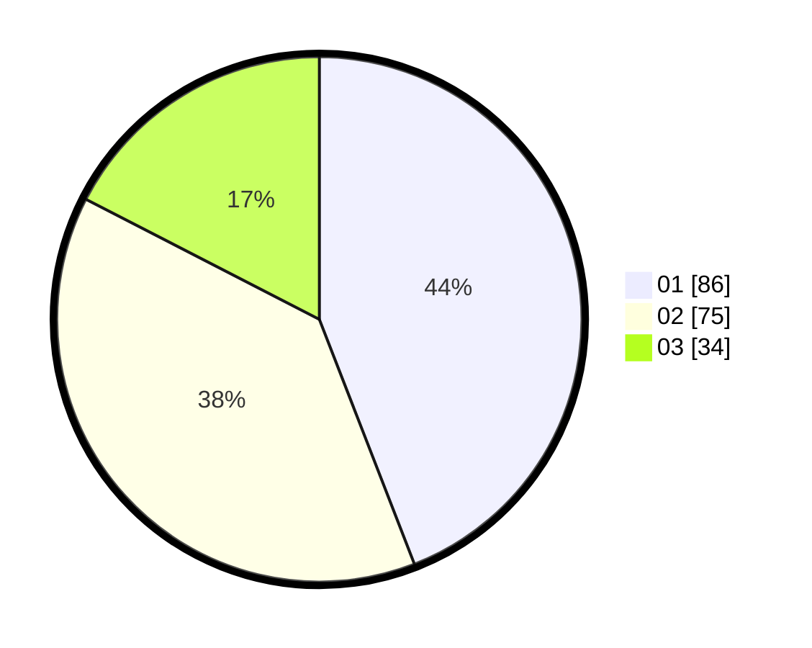

# Hasil

Hasil perolehan suara paslon dapat dilihat pada file paslon-01.txt, paslon-02.txt, dan paslon-03.txt.

Jika tidak ada, artinya data tersebut belum ada pada SIREKAP.

## Perolehan Suara

 * Paslon 01: **86**.
 * Paslon 02: **75**.
 * Paslon 03: **34**.

## Foto C Plano

https://sirekap-obj-formc.kpu.go.id/8472/pemilu/ppwp/31/73/04/10/05/3173041005035-20240216-144006--726db2b1-2b6d-401f-91f9-d9e9b03e025c.jpg

https://sirekap-obj-formc.kpu.go.id/8472/pemilu/ppwp/31/73/04/10/05/3173041005035-20240216-144007--d5e9022b-bb1d-4e7b-8947-acae6023e81c.jpg

https://sirekap-obj-formc.kpu.go.id/8472/pemilu/ppwp/31/73/04/10/05/3173041005035-20240216-144007--bdfabc6e-c0be-4fdd-bfab-a3d5f7bc71d8.jpg

## DATA PEMILIH TETAP

Jumlah pemilih dalam DPT: **267**.
 * L: **130**.
 * P: **137**.

## DATA PENGGUNA HAK PILIH

Jumlah pengguna hak pilih dalam DPT: **199**.
 * L: **97**.
 * P: **102**.

Jumlah pengguna hak pilih dalam DPTb: **0**.
 * L: **0**.
 * P: **0**.

Jumlah pengguna hak pilih dalam DPK: **8**.
 * L: **5**.
 * P: **3**.

Jumlah pengguna hak pilih: **207**.
 * L: **102**.
 * P: **105**.

## JUMLAH SUARA SAH DAN TIDAK SAH

JUMLAH SELURUH SUARA SAH: **195**.

JUMLAH SUARA TIDAK SAH: **4**.

JUMLAH SELURUH SUARA SAH DAN SUARA TIDAK SAH: **199**.
