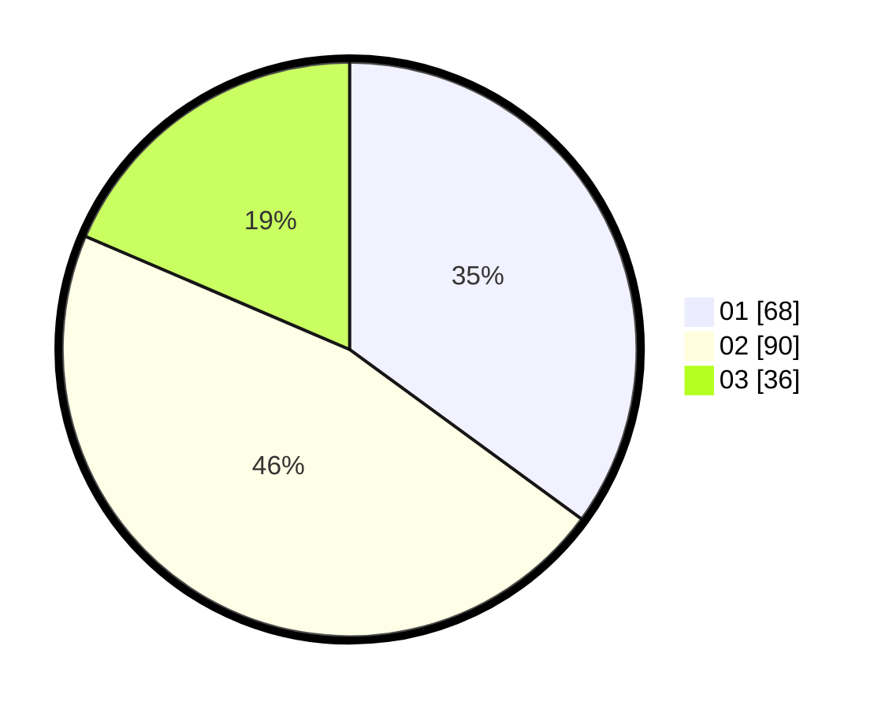

# Hasil

Hasil perolehan suara paslon dapat dilihat pada file paslon-01.txt, paslon-02.txt, dan paslon-03.txt.

Jika tidak ada, artinya data tersebut belum ada pada SIREKAP.

## Perolehan Suara

 * Paslon 01: **68**.
 * Paslon 02: **90**.
 * Paslon 03: **36**.

## Foto C Plano

https://sirekap-obj-formc.kpu.go.id/d023/pemilu/ppwp/31/73/04/10/05/3173041005037-20240214-213553--aacf20b9-d790-4adb-aa87-9dd3cc25b500.jpg

https://sirekap-obj-formc.kpu.go.id/d023/pemilu/ppwp/31/73/04/10/05/3173041005037-20240214-213614--84a1a830-cf39-4609-b9cf-5fedf02629fe.jpg

https://sirekap-obj-formc.kpu.go.id/d023/pemilu/ppwp/31/73/04/10/05/3173041005037-20240214-213603--13d5966c-667c-4696-b6ca-0e80d973c82b.jpg

## DATA PEMILIH TETAP

Jumlah pemilih dalam DPT: **195**.
 * L: **97**.
 * P: **98**.

## DATA PENGGUNA HAK PILIH

Jumlah pengguna hak pilih dalam DPT: **269**.
 * L: **139**.
 * P: **130**.

Jumlah pengguna hak pilih dalam DPTb: **3**.
 * L: **1**.
 * P: **2**.

Jumlah pengguna hak pilih dalam DPK: **0**.
 * L: **0**.
 * P: **0**.

Jumlah pengguna hak pilih: **272**.
 * L: **140**.
 * P: **132**.

## JUMLAH SUARA SAH DAN TIDAK SAH

JUMLAH SELURUH SUARA SAH: **194**.

JUMLAH SUARA TIDAK SAH: **4**.

JUMLAH SELURUH SUARA SAH DAN SUARA TIDAK SAH: **198**.
