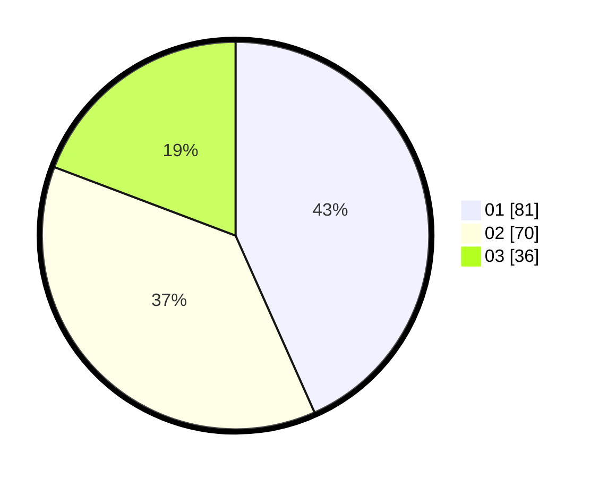

# Hasil

Hasil perolehan suara paslon dapat dilihat pada file paslon-01.txt, paslon-02.txt, dan paslon-03.txt.

Jika tidak ada, artinya data tersebut belum ada pada SIREKAP.

## Perolehan Suara

 * Paslon 01: **81**.
 * Paslon 02: **70**.
 * Paslon 03: **36**.

## Foto C Plano

https://sirekap-obj-formc.kpu.go.id/afee/pemilu/ppwp/31/73/04/10/05/3173041005038-20240216-040549--17bcd837-3127-41ae-9dd7-b34774f32286.jpg

https://sirekap-obj-formc.kpu.go.id/afee/pemilu/ppwp/31/73/04/10/05/3173041005038-20240216-040557--68c34326-aef3-4ea0-a183-508b52761e62.jpg

https://sirekap-obj-formc.kpu.go.id/afee/pemilu/ppwp/31/73/04/10/05/3173041005038-20240216-040550--377cfb5c-7dba-416e-81d6-f28903b77f0f.jpg

## DATA PEMILIH TETAP

Jumlah pemilih dalam DPT: **186**.
 * L: **92**.
 * P: **94**.

## DATA PENGGUNA HAK PILIH

Jumlah pengguna hak pilih dalam DPT: **186**.
 * L: **92**.
 * P: **94**.

Jumlah pengguna hak pilih dalam DPTb: **2**.
 * L: **1**.
 * P: **1**.

Jumlah pengguna hak pilih dalam DPK: **0**.
 * L: **0**.
 * P: **0**.

Jumlah pengguna hak pilih: **188**.
 * L: **93**.
 * P: **95**.

## JUMLAH SUARA SAH DAN TIDAK SAH

JUMLAH SELURUH SUARA SAH: **187**.

JUMLAH SUARA TIDAK SAH: **1**.

JUMLAH SELURUH SUARA SAH DAN SUARA TIDAK SAH: **188**.
