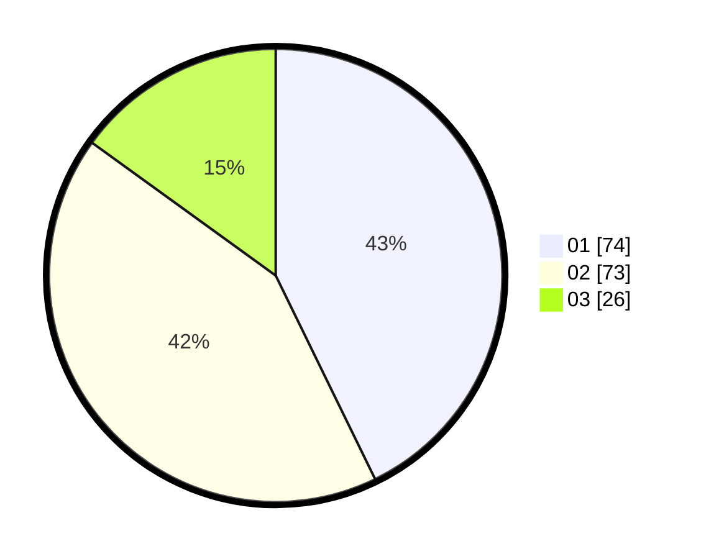

# Hasil

Hasil perolehan suara paslon dapat dilihat pada file paslon-01.txt, paslon-02.txt, dan paslon-03.txt.

Jika tidak ada, artinya data tersebut belum ada pada SIREKAP.

## Perolehan Suara

 * Paslon 01: **74**.
 * Paslon 02: **73**.
 * Paslon 03: **26**.

## Foto C Plano

https://sirekap-obj-formc.kpu.go.id/5bf5/pemilu/ppwp/31/73/04/10/05/3173041005043-20240215-174624--c0d5bb94-aad8-44cc-9e71-40f06acc00ab.jpg

https://sirekap-obj-formc.kpu.go.id/5bf5/pemilu/ppwp/31/73/04/10/05/3173041005043-20240215-174646--812b5fa6-5981-4b38-8a12-c0f1d967ceae.jpg

https://sirekap-obj-formc.kpu.go.id/5bf5/pemilu/ppwp/31/73/04/10/05/3173041005043-20240215-174635--a21fc783-5611-4c1b-b52e-ca6b8f04cfef.jpg

## DATA PEMILIH TETAP

Jumlah pemilih dalam DPT: **0**.
 * L: **0**.
 * P: **0**.

## DATA PENGGUNA HAK PILIH

Jumlah pengguna hak pilih dalam DPT: **178**.
 * L: **98**.
 * P: **80**.

Jumlah pengguna hak pilih dalam DPTb: **276**.
 * L: **0**.
 * P: **0**.

Jumlah pengguna hak pilih dalam DPK: **0**.
 * L: **0**.
 * P: **0**.

Jumlah pengguna hak pilih: **276**.
 * L: **0**.
 * P: **0**.

## JUMLAH SUARA SAH DAN TIDAK SAH

JUMLAH SELURUH SUARA SAH: **173**.

JUMLAH SUARA TIDAK SAH: **5**.

JUMLAH SELURUH SUARA SAH DAN SUARA TIDAK SAH: **178**.
