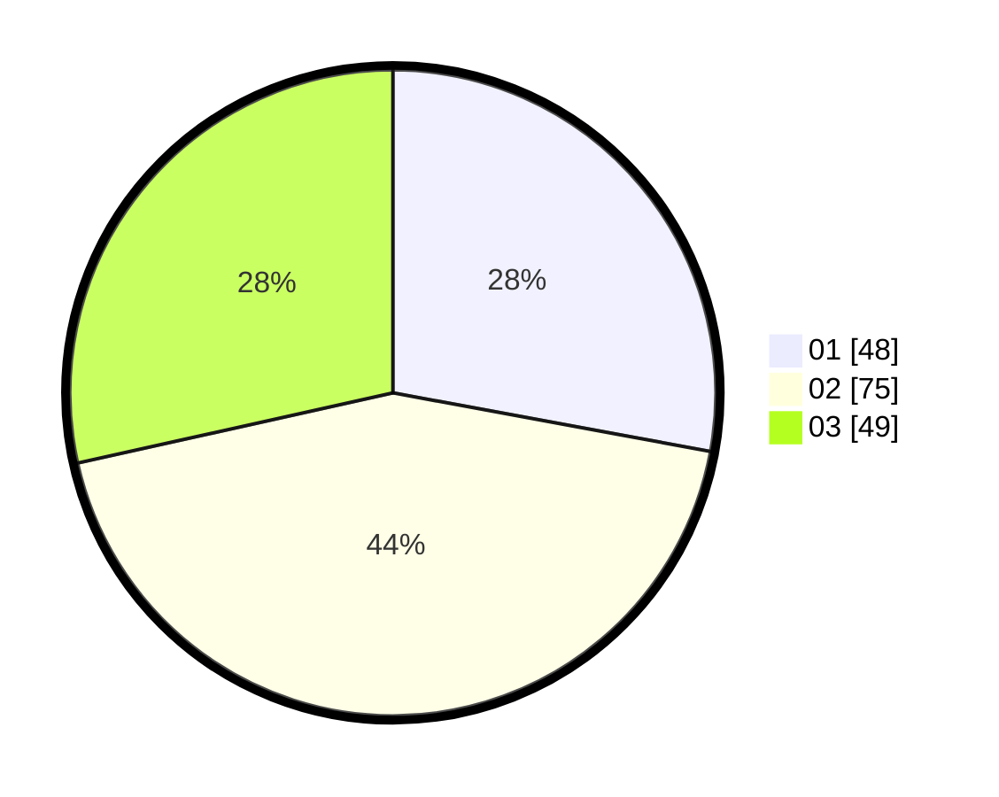

# Hasil

Hasil perolehan suara paslon dapat dilihat pada file paslon-01.txt, paslon-02.txt, dan paslon-03.txt.

Jika tidak ada, artinya data tersebut belum ada pada SIREKAP.

## Perolehan Suara

 * Paslon 01: **48**.
 * Paslon 02: **75**.
 * Paslon 03: **49**.

## Foto C Plano

https://sirekap-obj-formc.kpu.go.id/346b/pemilu/ppwp/31/73/04/10/05/3173041005045-20240216-013427--f51f7924-02f1-4815-8e7a-1ec3eb2a5d57.jpg

https://sirekap-obj-formc.kpu.go.id/346b/pemilu/ppwp/31/73/04/10/05/3173041005045-20240216-013428--da69f1cd-cefd-4ffd-9a57-78ed3bf86748.jpg

https://sirekap-obj-formc.kpu.go.id/346b/pemilu/ppwp/31/73/04/10/05/3173041005045-20240216-013427--a342c275-5a64-4acd-b51a-752918271f23.jpg

## DATA PEMILIH TETAP

Jumlah pemilih dalam DPT: **249**.
 * L: **128**.
 * P: **121**.

## DATA PENGGUNA HAK PILIH

Jumlah pengguna hak pilih dalam DPT: **173**.
 * L: **83**.
 * P: **90**.

Jumlah pengguna hak pilih dalam DPTb: **0**.
 * L: **0**.
 * P: **0**.

Jumlah pengguna hak pilih dalam DPK: **0**.
 * L: **0**.
 * P: **0**.

Jumlah pengguna hak pilih: **173**.
 * L: **83**.
 * P: **90**.

## JUMLAH SUARA SAH DAN TIDAK SAH

JUMLAH SELURUH SUARA SAH: **172**.

JUMLAH SUARA TIDAK SAH: **1**.

JUMLAH SELURUH SUARA SAH DAN SUARA TIDAK SAH: **173**.
