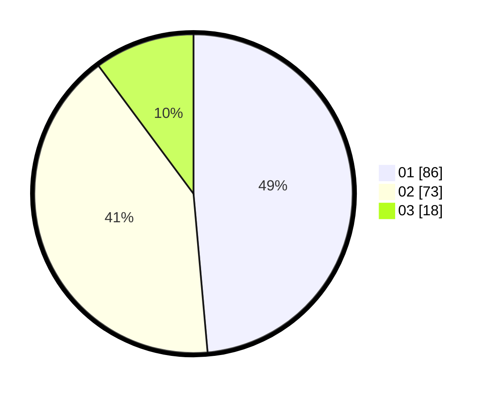

# Hasil

Hasil perolehan suara paslon dapat dilihat pada file paslon-01.txt, paslon-02.txt, dan paslon-03.txt.

Jika tidak ada, artinya data tersebut belum ada pada SIREKAP.

## Perolehan Suara

 * Paslon 01: **86**.
 * Paslon 02: **73**.
 * Paslon 03: **18**.

## Foto C Plano

https://sirekap-obj-formc.kpu.go.id/07d7/pemilu/ppwp/31/73/04/10/05/3173041005049-20240216-190444--3f86983e-6458-4dc8-8e64-ae826073d182.jpg

https://sirekap-obj-formc.kpu.go.id/07d7/pemilu/ppwp/31/73/04/10/05/3173041005049-20240216-190445--66b71d1f-5ee6-4d15-a6c3-710ccbe670e2.jpg

https://sirekap-obj-formc.kpu.go.id/07d7/pemilu/ppwp/31/73/04/10/05/3173041005049-20240216-190444--f27d6af0-82cd-476f-ada3-8311735e7d43.jpg

## DATA PEMILIH TETAP

Jumlah pemilih dalam DPT: **244**.
 * L: **127**.
 * P: **117**.

## DATA PENGGUNA HAK PILIH

Jumlah pengguna hak pilih dalam DPT: **184**.
 * L: **89**.
 * P: **95**.

Jumlah pengguna hak pilih dalam DPTb: **0**.
 * L: **0**.
 * P: **0**.

Jumlah pengguna hak pilih dalam DPK: **1**.
 * L: **0**.
 * P: **1**.

Jumlah pengguna hak pilih: **185**.
 * L: **89**.
 * P: **96**.

## JUMLAH SUARA SAH DAN TIDAK SAH

JUMLAH SELURUH SUARA SAH: **177**.

JUMLAH SUARA TIDAK SAH: **8**.

JUMLAH SELURUH SUARA SAH DAN SUARA TIDAK SAH: **185**.
