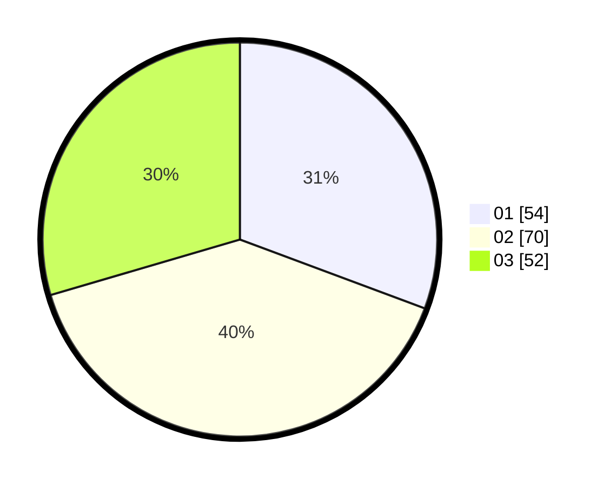

# Hasil

Hasil perolehan suara paslon dapat dilihat pada file paslon-01.txt, paslon-02.txt, dan paslon-03.txt.

Jika tidak ada, artinya data tersebut belum ada pada SIREKAP.

## Perolehan Suara

 * Paslon 01: **54**.
 * Paslon 02: **70**.
 * Paslon 03: **52**.

## Foto C Plano

https://sirekap-obj-formc.kpu.go.id/982f/pemilu/ppwp/31/73/04/10/05/3173041005050-20240214-155828--933538bf-b77f-432a-8374-5bad2ced7c08.jpg

https://sirekap-obj-formc.kpu.go.id/982f/pemilu/ppwp/31/73/04/10/05/3173041005050-20240214-160131--0b1e4479-88ab-4c81-91c4-66cefaa4dbf4.jpg

https://sirekap-obj-formc.kpu.go.id/982f/pemilu/ppwp/31/73/04/10/05/3173041005050-20240214-160106--a9557cd7-1243-4f64-9b06-96120dbff9a7.jpg

## DATA PEMILIH TETAP

Jumlah pemilih dalam DPT: **256**.
 * L: **129**.
 * P: **127**.

## DATA PENGGUNA HAK PILIH

Jumlah pengguna hak pilih dalam DPT: **180**.
 * L: **92**.
 * P: **88**.

Jumlah pengguna hak pilih dalam DPTb: **0**.
 * L: **0**.
 * P: **0**.

Jumlah pengguna hak pilih dalam DPK: **0**.
 * L: **0**.
 * P: **0**.

Jumlah pengguna hak pilih: **180**.
 * L: **92**.
 * P: **88**.

## JUMLAH SUARA SAH DAN TIDAK SAH

JUMLAH SELURUH SUARA SAH: **176**.

JUMLAH SUARA TIDAK SAH: **4**.

JUMLAH SELURUH SUARA SAH DAN SUARA TIDAK SAH: **180**.
