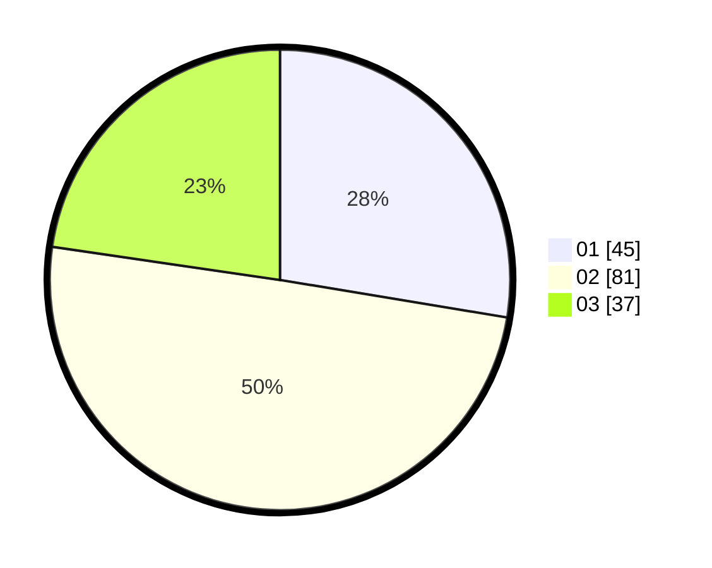

# Hasil

Hasil perolehan suara paslon dapat dilihat pada file paslon-01.txt, paslon-02.txt, dan paslon-03.txt.

Jika tidak ada, artinya data tersebut belum ada pada SIREKAP.

## Perolehan Suara

 * Paslon 01: **45**.
 * Paslon 02: **81**.
 * Paslon 03: **37**.

## Foto C Plano

https://sirekap-obj-formc.kpu.go.id/3b5b/pemilu/ppwp/31/73/04/10/05/3173041005053-20240215-031940--8a75716b-215c-4da9-a216-39b32f93ffcf.jpg

https://sirekap-obj-formc.kpu.go.id/3b5b/pemilu/ppwp/31/73/04/10/05/3173041005053-20240215-032002--485487db-5455-48fb-9f3b-dd72792432c2.jpg

https://sirekap-obj-formc.kpu.go.id/3b5b/pemilu/ppwp/31/73/04/10/05/3173041005053-20240215-031952--148d9a44-9ce8-4b63-9c8a-246c95158fbc.jpg

## DATA PEMILIH TETAP

Jumlah pemilih dalam DPT: **0**.
 * L: **0**.
 * P: **0**.

## DATA PENGGUNA HAK PILIH

Jumlah pengguna hak pilih dalam DPT: **0**.
 * L: **0**.
 * P: **0**.

Jumlah pengguna hak pilih dalam DPTb: **0**.
 * L: **0**.
 * P: **0**.

Jumlah pengguna hak pilih dalam DPK: **0**.
 * L: **0**.
 * P: **0**.

Jumlah pengguna hak pilih: **0**.
 * L: **0**.
 * P: **0**.

## JUMLAH SUARA SAH DAN TIDAK SAH

JUMLAH SELURUH SUARA SAH: **163**.

JUMLAH SUARA TIDAK SAH: **0**.

JUMLAH SELURUH SUARA SAH DAN SUARA TIDAK SAH: **163**.
