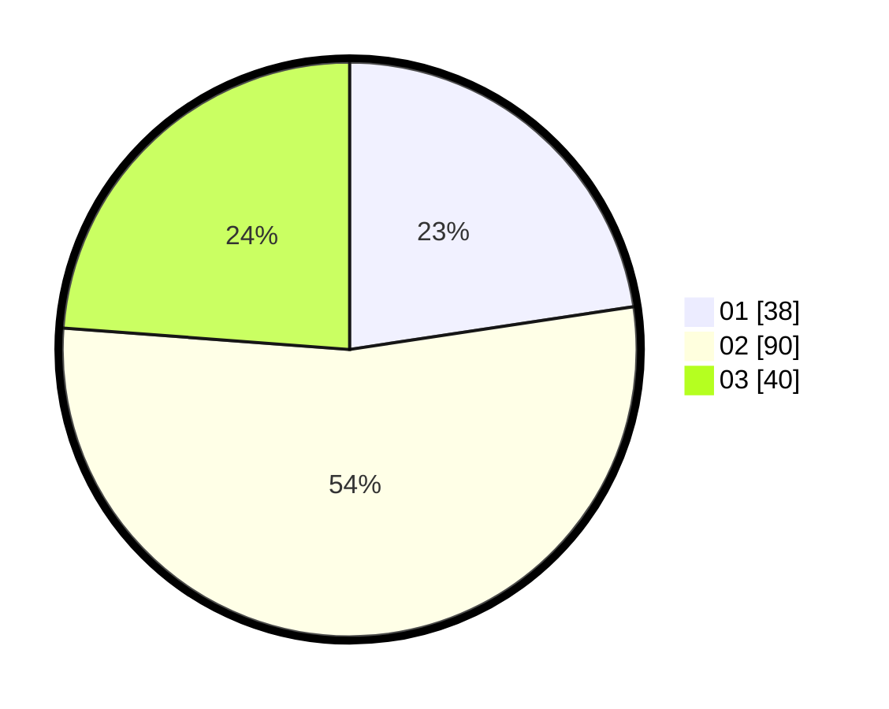

# Hasil

Hasil perolehan suara paslon dapat dilihat pada file paslon-01.txt, paslon-02.txt, dan paslon-03.txt.

Jika tidak ada, artinya data tersebut belum ada pada SIREKAP.

## Perolehan Suara

 * Paslon 01: **38**.
 * Paslon 02: **90**.
 * Paslon 03: **40**.

## Foto C Plano

https://sirekap-obj-formc.kpu.go.id/11e6/pemilu/ppwp/31/73/04/10/05/3173041005055-20240214-211726--b62830fc-59b7-46d7-a96b-bd880ea521ea.jpg

https://sirekap-obj-formc.kpu.go.id/11e6/pemilu/ppwp/31/73/04/10/05/3173041005055-20240214-211746--7f12ab71-762f-4ed4-8bbe-aa37e6baeb28.jpg

https://sirekap-obj-formc.kpu.go.id/11e6/pemilu/ppwp/31/73/04/10/05/3173041005055-20240214-211805--173f2b58-26e7-4db9-a383-0443d910c9de.jpg
