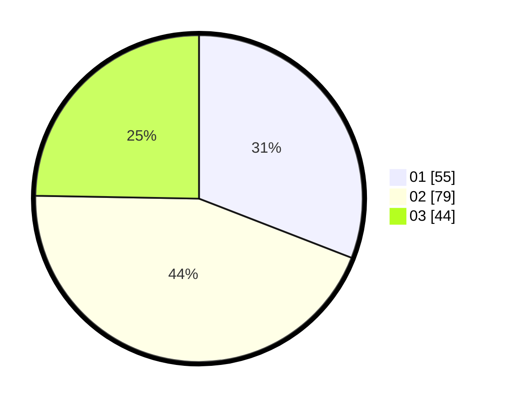

# Hasil

Hasil perolehan suara paslon dapat dilihat pada file paslon-01.txt, paslon-02.txt, dan paslon-03.txt.

Jika tidak ada, artinya data tersebut belum ada pada SIREKAP.

## Perolehan Suara

 * Paslon 01: **55**.
 * Paslon 02: **79**.
 * Paslon 03: **44**.

## Foto C Plano

https://sirekap-obj-formc.kpu.go.id/ed76/pemilu/ppwp/31/73/04/10/05/3173041005061-20240214-191559--686fdc00-3bb8-4554-9561-5e396d625f19.jpg

https://sirekap-obj-formc.kpu.go.id/ed76/pemilu/ppwp/31/73/04/10/05/3173041005061-20240214-191150--aba0c0e6-2f03-4115-9aca-6a670ea73d36.jpg

https://sirekap-obj-formc.kpu.go.id/ed76/pemilu/ppwp/31/73/04/10/05/3173041005061-20240214-190242--5f644846-0a2c-4f3b-80a0-29f400be3bfe.jpg

## DATA PEMILIH TETAP

Jumlah pemilih dalam DPT: **249**.
 * L: **120**.
 * P: **129**.

## DATA PENGGUNA HAK PILIH

Jumlah pengguna hak pilih dalam DPT: **179**.
 * L: **79**.
 * P: **100**.

Jumlah pengguna hak pilih dalam DPTb: **1**.
 * L: **0**.
 * P: **1**.

Jumlah pengguna hak pilih dalam DPK: **0**.
 * L: **0**.
 * P: **0**.

Jumlah pengguna hak pilih: **180**.
 * L: **79**.
 * P: **101**.

## JUMLAH SUARA SAH DAN TIDAK SAH

JUMLAH SELURUH SUARA SAH: **178**.

JUMLAH SUARA TIDAK SAH: **2**.

JUMLAH SELURUH SUARA SAH DAN SUARA TIDAK SAH: **180**.
