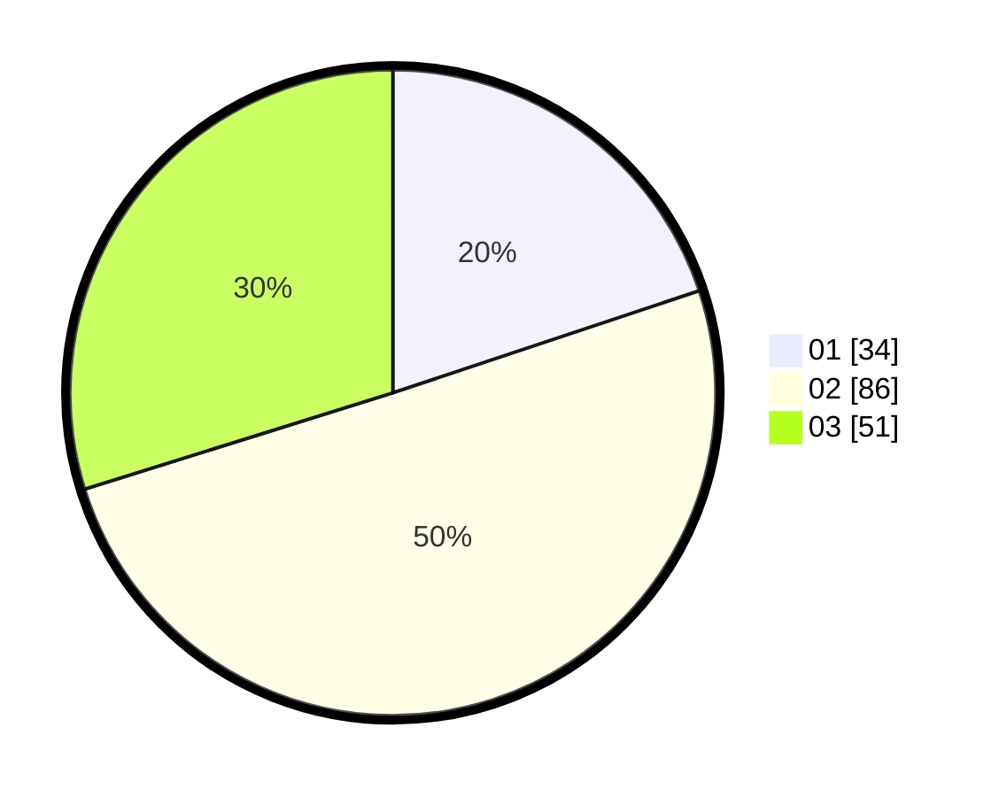

# Hasil

Hasil perolehan suara paslon dapat dilihat pada file paslon-01.txt, paslon-02.txt, dan paslon-03.txt.

Jika tidak ada, artinya data tersebut belum ada pada SIREKAP.

## Perolehan Suara

 * Paslon 01: **34**.
 * Paslon 02: **86**.
 * Paslon 03: **51**.

## Foto C Plano

https://sirekap-obj-formc.kpu.go.id/9ba5/pemilu/ppwp/31/73/04/10/05/3173041005062-20240215-225458--55d5b86d-6d5e-4d96-8157-ac9c136b0827.jpg

https://sirekap-obj-formc.kpu.go.id/9ba5/pemilu/ppwp/31/73/04/10/05/3173041005062-20240215-225502--cf5254d7-2ff6-48a2-a533-f5132d88e91f.jpg

https://sirekap-obj-formc.kpu.go.id/9ba5/pemilu/ppwp/31/73/04/10/05/3173041005062-20240215-225500--ee4139ba-f79e-4a2d-b8e5-a640a889a9d5.jpg

## DATA PEMILIH TETAP

Jumlah pemilih dalam DPT: **248**.
 * L: **125**.
 * P: **123**.

## DATA PENGGUNA HAK PILIH

Jumlah pengguna hak pilih dalam DPT: **167**.
 * L: **82**.
 * P: **85**.

Jumlah pengguna hak pilih dalam DPTb: **0**.
 * L: **0**.
 * P: **0**.

Jumlah pengguna hak pilih dalam DPK: **6**.
 * L: **4**.
 * P: **2**.

Jumlah pengguna hak pilih: **173**.
 * L: **86**.
 * P: **87**.

## JUMLAH SUARA SAH DAN TIDAK SAH

JUMLAH SELURUH SUARA SAH: **171**.

JUMLAH SUARA TIDAK SAH: **2**.

JUMLAH SELURUH SUARA SAH DAN SUARA TIDAK SAH: **173**.
