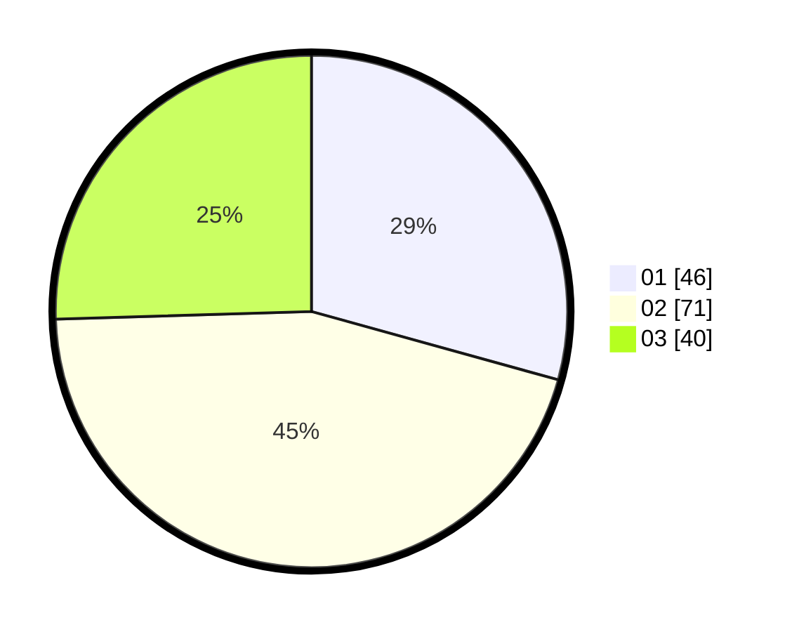

# Hasil

Hasil perolehan suara paslon dapat dilihat pada file paslon-01.txt, paslon-02.txt, dan paslon-03.txt.

Jika tidak ada, artinya data tersebut belum ada pada SIREKAP.

## Perolehan Suara

 * Paslon 01: **46**.
 * Paslon 02: **71**.
 * Paslon 03: **40**.

## Foto C Plano

https://sirekap-obj-formc.kpu.go.id/59fd/pemilu/ppwp/31/73/04/10/05/3173041005064-20240214-222311--fe9253ec-a86c-47bd-941b-c981747d5d07.jpg

https://sirekap-obj-formc.kpu.go.id/59fd/pemilu/ppwp/31/73/04/10/05/3173041005064-20240214-222337--945aa7cf-1c1b-4c39-ad40-1f596f9b8eba.jpg

https://sirekap-obj-formc.kpu.go.id/59fd/pemilu/ppwp/31/73/04/10/05/3173041005064-20240214-222431--61db8d6c-f62a-42be-bacc-330b1c778f63.jpg
