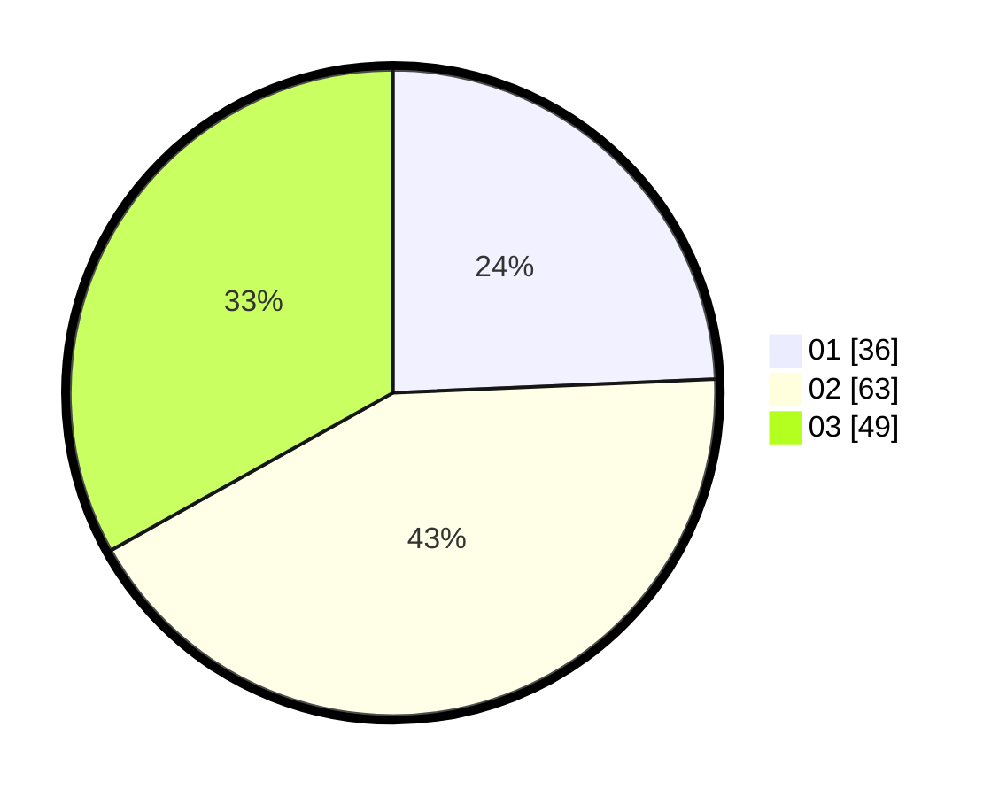

# Hasil

Hasil perolehan suara paslon dapat dilihat pada file paslon-01.txt, paslon-02.txt, dan paslon-03.txt.

Jika tidak ada, artinya data tersebut belum ada pada SIREKAP.

## Perolehan Suara

 * Paslon 01: **36**.
 * Paslon 02: **63**.
 * Paslon 03: **49**.

## Foto C Plano

https://sirekap-obj-formc.kpu.go.id/6732/pemilu/ppwp/31/73/04/10/05/3173041005067-20240215-092209--9a8f227d-59e7-4d45-8496-461d9c2e0951.jpg

https://sirekap-obj-formc.kpu.go.id/6732/pemilu/ppwp/31/73/04/10/05/3173041005067-20240215-092230--b25907cf-469b-4276-8b4c-32c834a14b73.jpg

https://sirekap-obj-formc.kpu.go.id/6732/pemilu/ppwp/31/73/04/10/05/3173041005067-20240215-092219--c1cbcbb5-c339-47a2-89dd-7f5a1aa675dc.jpg

## DATA PEMILIH TETAP

Jumlah pemilih dalam DPT: **152**.
 * L: **75**.
 * P: **77**.

## DATA PENGGUNA HAK PILIH

Jumlah pengguna hak pilih dalam DPT: **152**.
 * L: **75**.
 * P: **77**.

Jumlah pengguna hak pilih dalam DPTb: **0**.
 * L: **0**.
 * P: **0**.

Jumlah pengguna hak pilih dalam DPK: **0**.
 * L: **0**.
 * P: **0**.

Jumlah pengguna hak pilih: **152**.
 * L: **75**.
 * P: **77**.

## JUMLAH SUARA SAH DAN TIDAK SAH

JUMLAH SELURUH SUARA SAH: **148**.

JUMLAH SUARA TIDAK SAH: **4**.

JUMLAH SELURUH SUARA SAH DAN SUARA TIDAK SAH: **152**.
