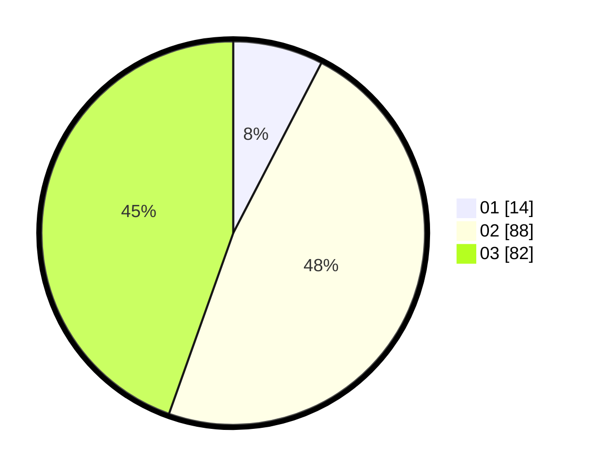

# Hasil

Hasil perolehan suara paslon dapat dilihat pada file paslon-01.txt, paslon-02.txt, dan paslon-03.txt.

Jika tidak ada, artinya data tersebut belum ada pada SIREKAP.

## Perolehan Suara

 * Paslon 01: **14**.
 * Paslon 02: **88**.
 * Paslon 03: **82**.

## Foto C Plano

https://sirekap-obj-formc.kpu.go.id/3ee1/pemilu/ppwp/31/73/04/10/05/3173041005069-20240215-033123--a0ebbe58-87ca-4316-99d0-da9ee0478dd7.jpg

https://sirekap-obj-formc.kpu.go.id/3ee1/pemilu/ppwp/31/73/04/10/05/3173041005069-20240215-033145--1136e378-e0c5-4d6e-bd9c-20e72f0618d1.jpg

https://sirekap-obj-formc.kpu.go.id/3ee1/pemilu/ppwp/31/73/04/10/05/3173041005069-20240215-033134--89e23520-3a98-4e7e-8485-b5b9aa71ba6b.jpg

## DATA PEMILIH TETAP

Jumlah pemilih dalam DPT: **258**.
 * L: **126**.
 * P: **132**.

## DATA PENGGUNA HAK PILIH

Jumlah pengguna hak pilih dalam DPT: **182**.
 * L: **90**.
 * P: **92**.

Jumlah pengguna hak pilih dalam DPTb: **2**.
 * L: **1**.
 * P: **1**.

Jumlah pengguna hak pilih dalam DPK: **0**.
 * L: **0**.
 * P: **0**.

Jumlah pengguna hak pilih: **184**.
 * L: **91**.
 * P: **93**.

## JUMLAH SUARA SAH DAN TIDAK SAH

JUMLAH SELURUH SUARA SAH: **184**.

JUMLAH SUARA TIDAK SAH: **0**.

JUMLAH SELURUH SUARA SAH DAN SUARA TIDAK SAH: **184**.
