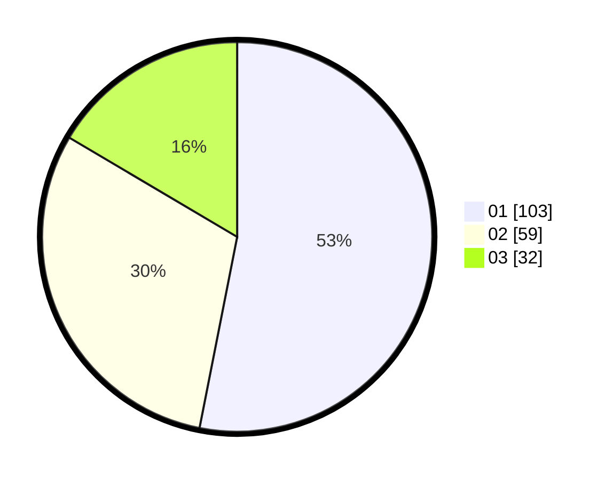

# Hasil

Hasil perolehan suara paslon dapat dilihat pada file paslon-01.txt, paslon-02.txt, dan paslon-03.txt.

Jika tidak ada, artinya data tersebut belum ada pada SIREKAP.

## Perolehan Suara

 * Paslon 01: **103**.
 * Paslon 02: **59**.
 * Paslon 03: **32**.

## Foto C Plano

https://sirekap-obj-formc.kpu.go.id/03f1/pemilu/ppwp/31/73/04/10/06/3173041006005-20240214-225145--79de0e08-1018-4ce8-837d-a55d7ddad978.jpg

https://sirekap-obj-formc.kpu.go.id/03f1/pemilu/ppwp/31/73/04/10/06/3173041006005-20240214-224743--fb7321c4-f64c-4a22-b590-4436a2cb112a.jpg

https://sirekap-obj-formc.kpu.go.id/03f1/pemilu/ppwp/31/73/04/10/06/3173041006005-20240214-224758--fc359e3c-3355-4bd2-9f7f-ecdffb8f3cb2.jpg

## DATA PEMILIH TETAP

Jumlah pemilih dalam DPT: **278**.
 * L: **147**.
 * P: **131**.

## DATA PENGGUNA HAK PILIH

Jumlah pengguna hak pilih dalam DPT: **200**.
 * L: **104**.
 * P: **96**.

Jumlah pengguna hak pilih dalam DPTb: **0**.
 * L: **0**.
 * P: **0**.

Jumlah pengguna hak pilih dalam DPK: **0**.
 * L: **0**.
 * P: **0**.

Jumlah pengguna hak pilih: **200**.
 * L: **104**.
 * P: **96**.

## JUMLAH SUARA SAH DAN TIDAK SAH

JUMLAH SELURUH SUARA SAH: **194**.

JUMLAH SUARA TIDAK SAH: **6**.

JUMLAH SELURUH SUARA SAH DAN SUARA TIDAK SAH: **200**.
