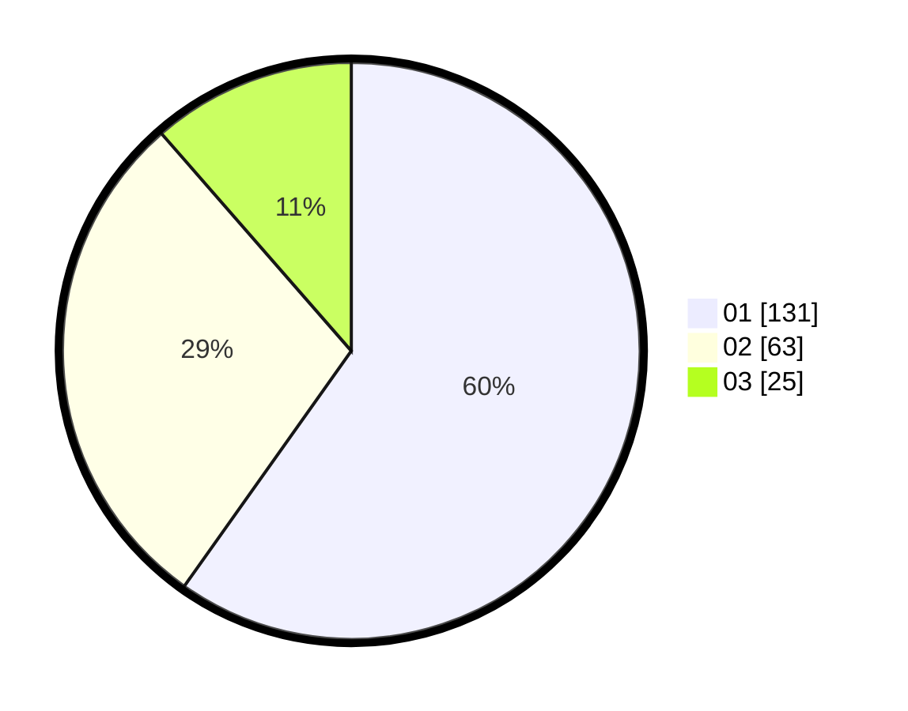

# Hasil

Hasil perolehan suara paslon dapat dilihat pada file paslon-01.txt, paslon-02.txt, dan paslon-03.txt.

Jika tidak ada, artinya data tersebut belum ada pada SIREKAP.

## Perolehan Suara

 * Paslon 01: **131**.
 * Paslon 02: **63**.
 * Paslon 03: **25**.

## Foto C Plano

https://sirekap-obj-formc.kpu.go.id/1dd6/pemilu/ppwp/31/73/04/10/06/3173041006009-20240214-215551--021dac1c-101d-4c93-9312-b73f5d51391b.jpg

https://sirekap-obj-formc.kpu.go.id/1dd6/pemilu/ppwp/31/73/04/10/06/3173041006009-20240214-215739--4cda372e-ff26-4db8-84a9-367f0f6dd572.jpg

https://sirekap-obj-formc.kpu.go.id/1dd6/pemilu/ppwp/31/73/04/10/06/3173041006009-20240214-215918--39d11315-ab51-4a78-96e4-7fb76f174d5e.jpg
