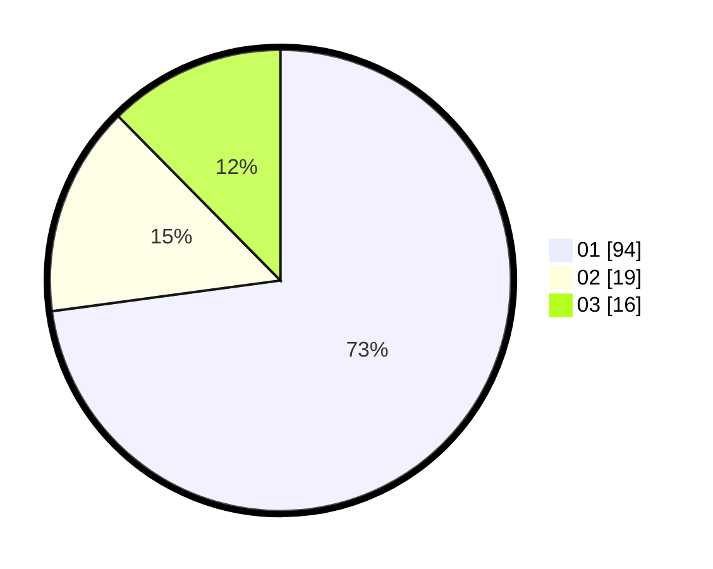

# Hasil

Hasil perolehan suara paslon dapat dilihat pada file paslon-01.txt, paslon-02.txt, dan paslon-03.txt.

Jika tidak ada, artinya data tersebut belum ada pada SIREKAP.

## Perolehan Suara

 * Paslon 01: **94**.
 * Paslon 02: **19**.
 * Paslon 03: **16**.

## Foto C Plano

https://sirekap-obj-formc.kpu.go.id/4a7f/pemilu/ppwp/31/73/04/10/06/3173041006011-20240214-232636--91dd92da-641b-4745-8a5f-00b5dcd882dd.jpg

https://sirekap-obj-formc.kpu.go.id/4a7f/pemilu/ppwp/31/73/04/10/06/3173041006011-20240214-232849--f15877e4-3215-485b-94c4-fe0453460b3a.jpg
