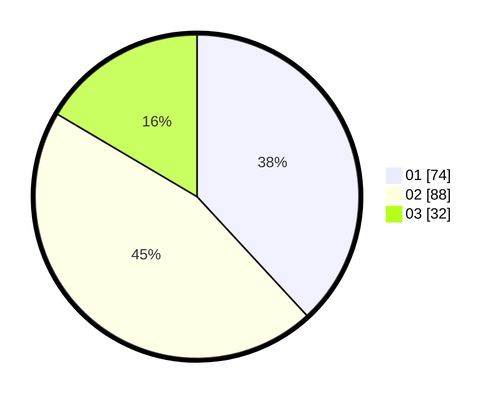

# Hasil

Hasil perolehan suara paslon dapat dilihat pada file paslon-01.txt, paslon-02.txt, dan paslon-03.txt.

Jika tidak ada, artinya data tersebut belum ada pada SIREKAP.

## Perolehan Suara

 * Paslon 01: **74**.
 * Paslon 02: **88**.
 * Paslon 03: **32**.

## Foto C Plano

https://sirekap-obj-formc.kpu.go.id/ad1f/pemilu/ppwp/31/73/04/10/06/3173041006022-20240214-160153--8878a743-bbf1-4dc7-8cf1-a1d93ded2d01.jpg

https://sirekap-obj-formc.kpu.go.id/ad1f/pemilu/ppwp/31/73/04/10/06/3173041006022-20240214-155344--063f5f85-85d7-4893-a45f-8d6e3b7c3565.jpg

https://sirekap-obj-formc.kpu.go.id/ad1f/pemilu/ppwp/31/73/04/10/06/3173041006022-20240214-155456--45e5db92-ccb6-4d72-b56a-bc7a7d002293.jpg
