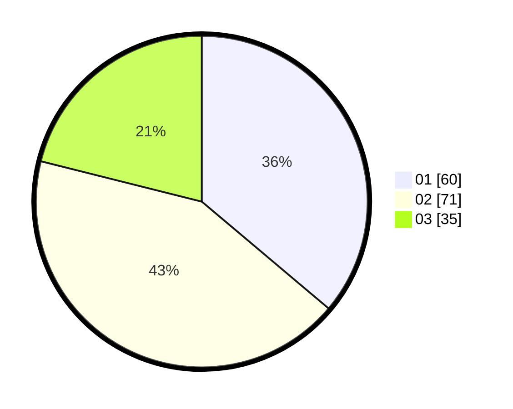

# Hasil

Hasil perolehan suara paslon dapat dilihat pada file paslon-01.txt, paslon-02.txt, dan paslon-03.txt.

Jika tidak ada, artinya data tersebut belum ada pada SIREKAP.

## Perolehan Suara

 * Paslon 01: **60**.
 * Paslon 02: **71**.
 * Paslon 03: **35**.

## Foto C Plano

https://sirekap-obj-formc.kpu.go.id/1857/pemilu/ppwp/31/73/04/10/06/3173041006024-20240215-024016--7455ecc2-bcd3-44c6-82e0-045f04c6b157.jpg

https://sirekap-obj-formc.kpu.go.id/1857/pemilu/ppwp/31/73/04/10/06/3173041006024-20240215-024139--fd355b59-b203-4976-b3d4-54f0e07b5da4.jpg
