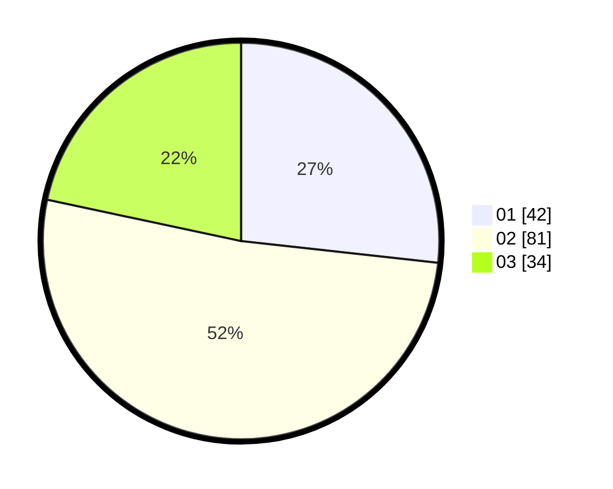

# Hasil

Hasil perolehan suara paslon dapat dilihat pada file paslon-01.txt, paslon-02.txt, dan paslon-03.txt.

Jika tidak ada, artinya data tersebut belum ada pada SIREKAP.

## Perolehan Suara

 * Paslon 01: **42**.
 * Paslon 02: **81**.
 * Paslon 03: **34**.

## Foto C Plano

https://sirekap-obj-formc.kpu.go.id/771d/pemilu/ppwp/31/73/04/10/06/3173041006030-20240214-211816--fd6bcc6c-9800-4521-93a1-4ae9123e8040.jpg

https://sirekap-obj-formc.kpu.go.id/771d/pemilu/ppwp/31/73/04/10/06/3173041006030-20240214-211957--1d80bc41-5579-49b2-b569-2cec334491ec.jpg

https://sirekap-obj-formc.kpu.go.id/771d/pemilu/ppwp/31/73/04/10/06/3173041006030-20240214-212328--d5735966-2c92-4838-b558-e8396200fca4.jpg
