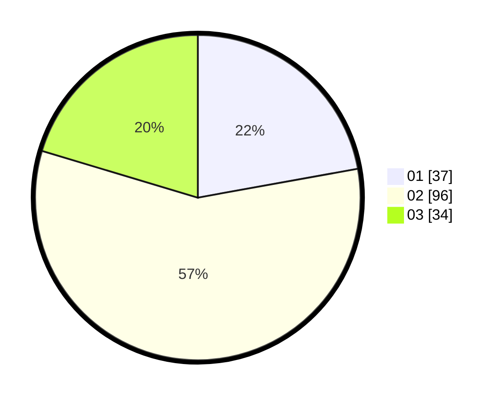

# Hasil

Hasil perolehan suara paslon dapat dilihat pada file paslon-01.txt, paslon-02.txt, dan paslon-03.txt.

Jika tidak ada, artinya data tersebut belum ada pada SIREKAP.

## Perolehan Suara

 * Paslon 01: **37**.
 * Paslon 02: **96**.
 * Paslon 03: **34**.

## Foto C Plano

https://sirekap-obj-formc.kpu.go.id/5300/pemilu/ppwp/31/73/04/10/06/3173041006040-20240215-005145--fca98f0d-c53e-4008-9bab-e3f4d04d200a.jpg

https://sirekap-obj-formc.kpu.go.id/5300/pemilu/ppwp/31/73/04/10/06/3173041006040-20240215-005244--01814497-9daa-480d-961e-d7f83f824adc.jpg

https://sirekap-obj-formc.kpu.go.id/5300/pemilu/ppwp/31/73/04/10/06/3173041006040-20240215-005501--60bb15ea-0694-4e2c-8048-70bad7228d6b.jpg
