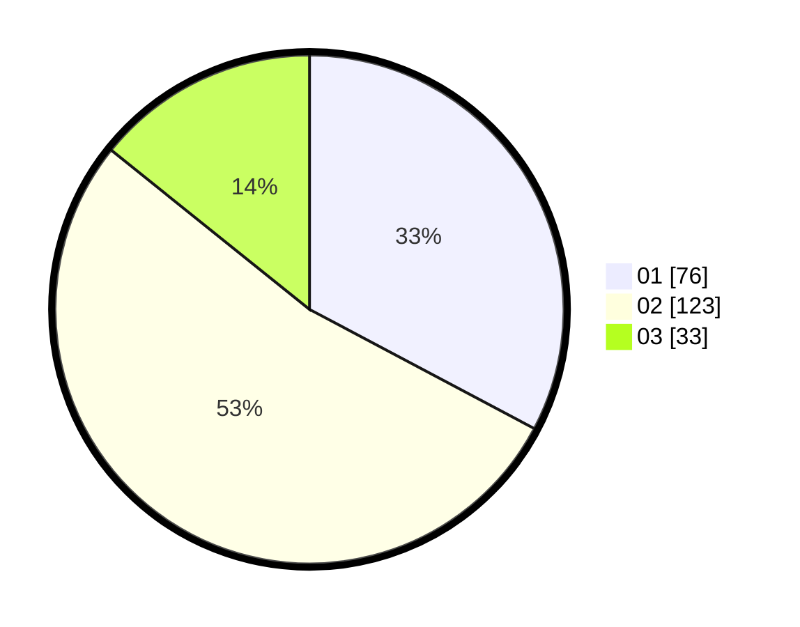

# Hasil

Hasil perolehan suara paslon dapat dilihat pada file paslon-01.txt, paslon-02.txt, dan paslon-03.txt.

Jika tidak ada, artinya data tersebut belum ada pada SIREKAP.

## Perolehan Suara

 * Paslon 01: **76**.
 * Paslon 02: **123**.
 * Paslon 03: **33**.

## Foto C Plano

https://sirekap-obj-formc.kpu.go.id/819b/pemilu/ppwp/31/73/04/10/06/3173041006041-20240214-213240--0a25c672-9487-4ae7-950b-fcfbd3b0bcb1.jpg

https://sirekap-obj-formc.kpu.go.id/819b/pemilu/ppwp/31/73/04/10/06/3173041006041-20240214-213336--296ad038-b597-458f-b891-e955c9a9b655.jpg

https://sirekap-obj-formc.kpu.go.id/819b/pemilu/ppwp/31/73/04/10/06/3173041006041-20240214-213425--a4dc557e-7a62-40bf-aad5-1ff8bfe1b376.jpg
