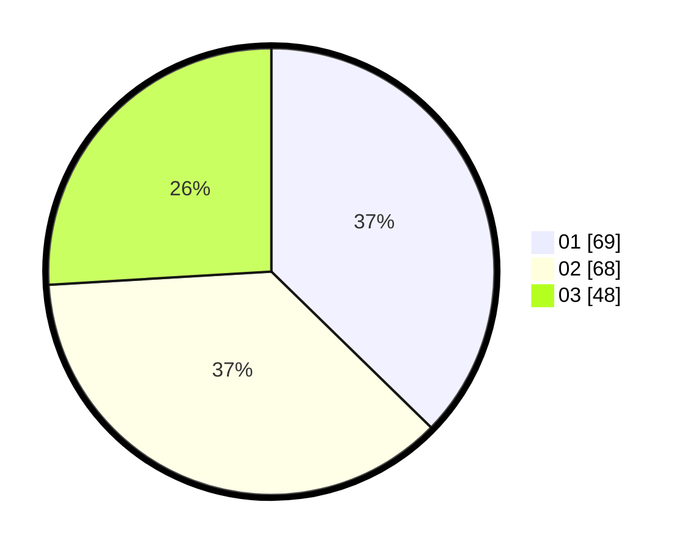

# Hasil

Hasil perolehan suara paslon dapat dilihat pada file paslon-01.txt, paslon-02.txt, dan paslon-03.txt.

Jika tidak ada, artinya data tersebut belum ada pada SIREKAP.

## Perolehan Suara

 * Paslon 01: **69**.
 * Paslon 02: **68**.
 * Paslon 03: **48**.

## Foto C Plano

https://sirekap-obj-formc.kpu.go.id/2e18/pemilu/ppwp/31/73/04/10/06/3173041006045-20240214-193910--c4b32146-7821-4487-8e5b-6dfa972e785b.jpg

https://sirekap-obj-formc.kpu.go.id/2e18/pemilu/ppwp/31/73/04/10/06/3173041006045-20240214-194343--848e0abf-7481-4489-bf7f-ecc8eda899b9.jpg

https://sirekap-obj-formc.kpu.go.id/2e18/pemilu/ppwp/31/73/04/10/06/3173041006045-20240214-194433--db107502-62ce-4341-b169-c00de226b6a9.jpg

## DATA PEMILIH TETAP

Jumlah pemilih dalam DPT: **277**.
 * L: **150**.
 * P: **127**.

## DATA PENGGUNA HAK PILIH

Jumlah pengguna hak pilih dalam DPT: **184**.
 * L: **100**.
 * P: **84**.

Jumlah pengguna hak pilih dalam DPTb: **2**.
 * L: **1**.
 * P: **1**.

Jumlah pengguna hak pilih dalam DPK: **0**.
 * L: **0**.
 * P: **0**.

Jumlah pengguna hak pilih: **186**.
 * L: **101**.
 * P: **85**.

## JUMLAH SUARA SAH DAN TIDAK SAH

JUMLAH SELURUH SUARA SAH: **185**.

JUMLAH SUARA TIDAK SAH: **1**.

JUMLAH SELURUH SUARA SAH DAN SUARA TIDAK SAH: **186**.
