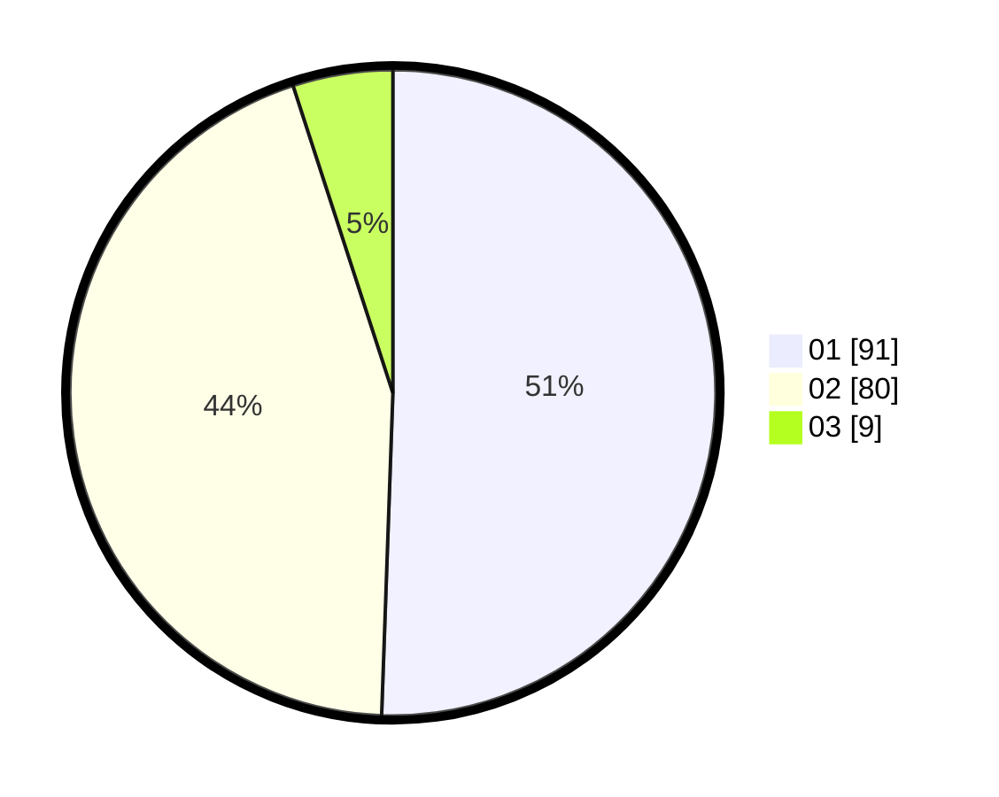

# Hasil

Hasil perolehan suara paslon dapat dilihat pada file paslon-01.txt, paslon-02.txt, dan paslon-03.txt.

Jika tidak ada, artinya data tersebut belum ada pada SIREKAP.

## Perolehan Suara

 * Paslon 01: **91**.
 * Paslon 02: **80**.
 * Paslon 03: **9**.

## Foto C Plano

https://sirekap-obj-formc.kpu.go.id/d046/pemilu/ppwp/31/73/04/10/06/3173041006046-20240215-001715--ac94ae19-e948-4de2-bd41-9e552c3cb733.jpg

https://sirekap-obj-formc.kpu.go.id/d046/pemilu/ppwp/31/73/04/10/06/3173041006046-20240215-001050--b37f728f-c657-4a35-9683-27024ea2cb89.jpg

https://sirekap-obj-formc.kpu.go.id/d046/pemilu/ppwp/31/73/04/10/06/3173041006046-20240215-001333--8a8be74c-ee51-41bc-90cd-e49a80fd71a3.jpg
