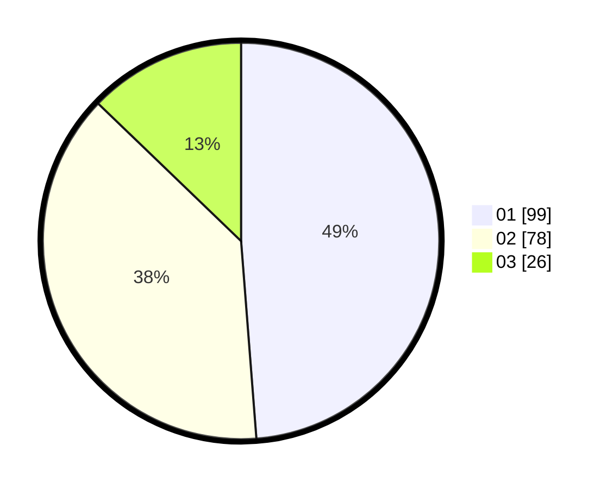

# Hasil

Hasil perolehan suara paslon dapat dilihat pada file paslon-01.txt, paslon-02.txt, dan paslon-03.txt.

Jika tidak ada, artinya data tersebut belum ada pada SIREKAP.

## Perolehan Suara

 * Paslon 01: **99**.
 * Paslon 02: **78**.
 * Paslon 03: **26**.

## Foto C Plano

https://sirekap-obj-formc.kpu.go.id/0659/pemilu/ppwp/31/73/04/10/06/3173041006047-20240214-192647--33765a05-ade1-46ef-81ae-6db0b875decc.jpg

https://sirekap-obj-formc.kpu.go.id/0659/pemilu/ppwp/31/73/04/10/06/3173041006047-20240214-213729--6d20028e-5a30-49bd-8a86-5b96cefb0bfe.jpg

https://sirekap-obj-formc.kpu.go.id/0659/pemilu/ppwp/31/73/04/10/06/3173041006047-20240214-195805--6911d7a1-f509-4a34-810e-7cea8c00f1b5.jpg

## DATA PEMILIH TETAP

Jumlah pemilih dalam DPT: **273**.
 * L: **141**.
 * P: **132**.

## DATA PENGGUNA HAK PILIH

Jumlah pengguna hak pilih dalam DPT: **204**.
 * L: **102**.
 * P: **102**.

Jumlah pengguna hak pilih dalam DPTb: **0**.
 * L: **0**.
 * P: **0**.

Jumlah pengguna hak pilih dalam DPK: **2**.
 * L: **2**.
 * P: **0**.

Jumlah pengguna hak pilih: **206**.
 * L: **104**.
 * P: **102**.

## JUMLAH SUARA SAH DAN TIDAK SAH

JUMLAH SELURUH SUARA SAH: **0**.

JUMLAH SUARA TIDAK SAH: **3**.

JUMLAH SELURUH SUARA SAH DAN SUARA TIDAK SAH: **206**.
