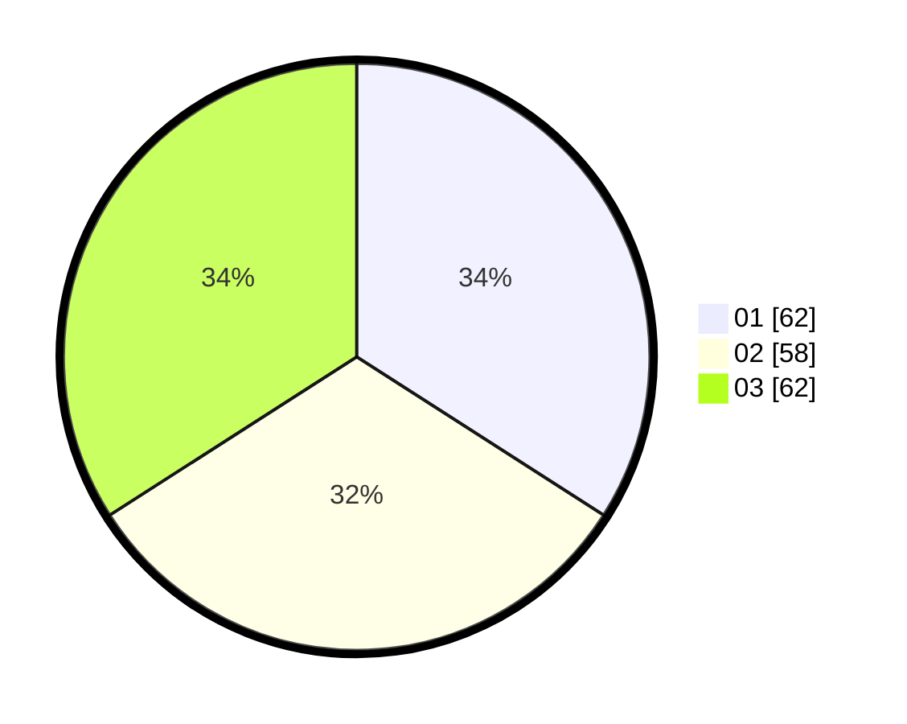

# Hasil

Hasil perolehan suara paslon dapat dilihat pada file paslon-01.txt, paslon-02.txt, dan paslon-03.txt.

Jika tidak ada, artinya data tersebut belum ada pada SIREKAP.

## Perolehan Suara

 * Paslon 01: **62**.
 * Paslon 02: **58**.
 * Paslon 03: **62**.

## Foto C Plano

https://sirekap-obj-formc.kpu.go.id/689e/pemilu/ppwp/31/73/04/10/06/3173041006049-20240215-003320--424d14ed-524b-4af3-93ed-2d235fa06a3b.jpg

https://sirekap-obj-formc.kpu.go.id/689e/pemilu/ppwp/31/73/04/10/06/3173041006049-20240214-233026--a0ce2209-48f6-4669-8f8d-dd25ca7b9031.jpg

https://sirekap-obj-formc.kpu.go.id/689e/pemilu/ppwp/31/73/04/10/06/3173041006049-20240214-200436--86d5b0a8-b9d7-429a-abe2-14b1b336d5a9.jpg
