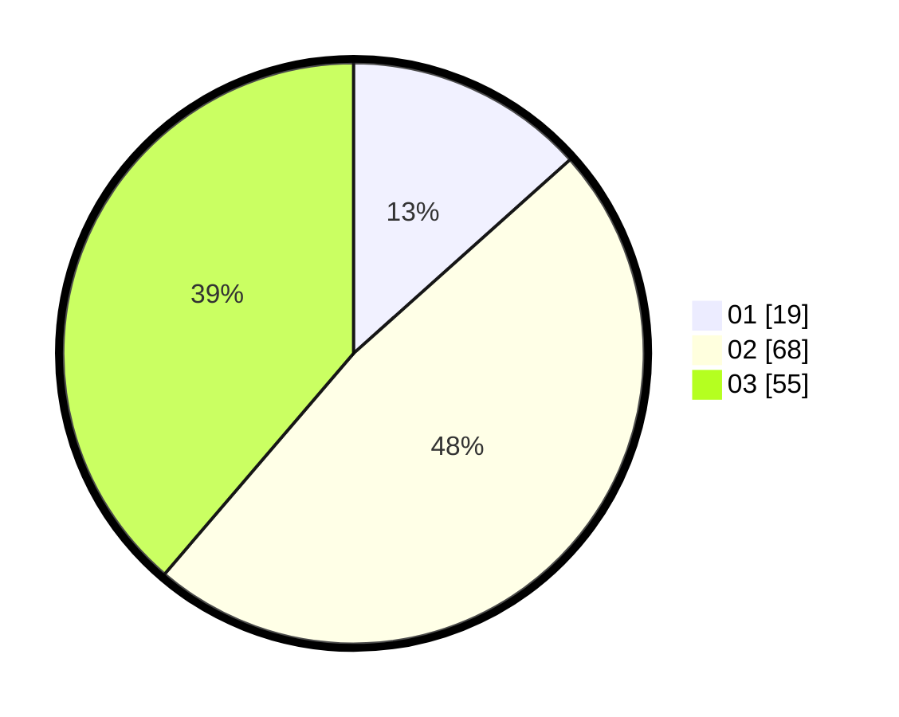

# Hasil

Hasil perolehan suara paslon dapat dilihat pada file paslon-01.txt, paslon-02.txt, dan paslon-03.txt.

Jika tidak ada, artinya data tersebut belum ada pada SIREKAP.

## Perolehan Suara

 * Paslon 01: **19**.
 * Paslon 02: **68**.
 * Paslon 03: **55**.

## Foto C Plano

https://sirekap-obj-formc.kpu.go.id/82cf/pemilu/ppwp/31/73/04/10/06/3173041006050-20240214-212824--da38bc12-c1e3-4b4c-ad21-437db190f8c6.jpg

https://sirekap-obj-formc.kpu.go.id/82cf/pemilu/ppwp/31/73/04/10/06/3173041006050-20240214-230146--88883102-e5c1-456a-9216-02f18e9d21c6.jpg

https://sirekap-obj-formc.kpu.go.id/82cf/pemilu/ppwp/31/73/04/10/06/3173041006050-20240214-212926--b3a3e977-08c3-4f76-9a8e-0a6df5a3216b.jpg
