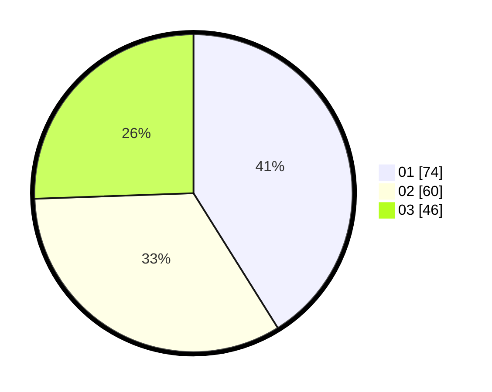

# Hasil

Hasil perolehan suara paslon dapat dilihat pada file paslon-01.txt, paslon-02.txt, dan paslon-03.txt.

Jika tidak ada, artinya data tersebut belum ada pada SIREKAP.

## Perolehan Suara

 * Paslon 01: **74**.
 * Paslon 02: **60**.
 * Paslon 03: **46**.

## Foto C Plano

https://sirekap-obj-formc.kpu.go.id/aa33/pemilu/ppwp/31/73/04/10/06/3173041006053-20240214-210851--fbaddd15-36f0-4ce9-9de7-92efcf984b56.jpg

https://sirekap-obj-formc.kpu.go.id/aa33/pemilu/ppwp/31/73/04/10/06/3173041006053-20240214-220823--a8c4cc8b-e228-4086-ae6f-13bc0623c694.jpg

https://sirekap-obj-formc.kpu.go.id/aa33/pemilu/ppwp/31/73/04/10/06/3173041006053-20240214-220321--6c922069-8cc8-4e56-8878-1fe3dee6f275.jpg

## DATA PEMILIH TETAP

Jumlah pemilih dalam DPT: **274**.
 * L: **137**.
 * P: **137**.

## DATA PENGGUNA HAK PILIH

Jumlah pengguna hak pilih dalam DPT: **180**.
 * L: **89**.
 * P: **91**.

Jumlah pengguna hak pilih dalam DPTb: **0**.
 * L: **0**.
 * P: **0**.

Jumlah pengguna hak pilih dalam DPK: **1**.
 * L: **0**.
 * P: **1**.

Jumlah pengguna hak pilih: **181**.
 * L: **89**.
 * P: **92**.

## JUMLAH SUARA SAH DAN TIDAK SAH

JUMLAH SELURUH SUARA SAH: **180**.

JUMLAH SUARA TIDAK SAH: **1**.

JUMLAH SELURUH SUARA SAH DAN SUARA TIDAK SAH: **181**.
