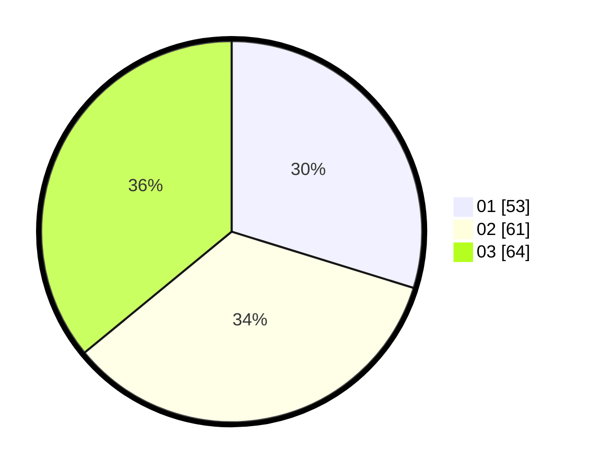

# Hasil

Hasil perolehan suara paslon dapat dilihat pada file paslon-01.txt, paslon-02.txt, dan paslon-03.txt.

Jika tidak ada, artinya data tersebut belum ada pada SIREKAP.

## Perolehan Suara

 * Paslon 01: **53**.
 * Paslon 02: **61**.
 * Paslon 03: **64**.

## Foto C Plano

https://sirekap-obj-formc.kpu.go.id/e9b9/pemilu/ppwp/31/73/04/10/06/3173041006054-20240215-021041--34dd3677-ada8-45a8-a27c-fcffb8977c0f.jpg

https://sirekap-obj-formc.kpu.go.id/e9b9/pemilu/ppwp/31/73/04/10/06/3173041006054-20240215-021128--87033f6b-2305-40f6-81e9-615a46bd6b5f.jpg

https://sirekap-obj-formc.kpu.go.id/e9b9/pemilu/ppwp/31/73/04/10/06/3173041006054-20240215-021219--42300744-36da-4b30-b04c-76835662dbd9.jpg
