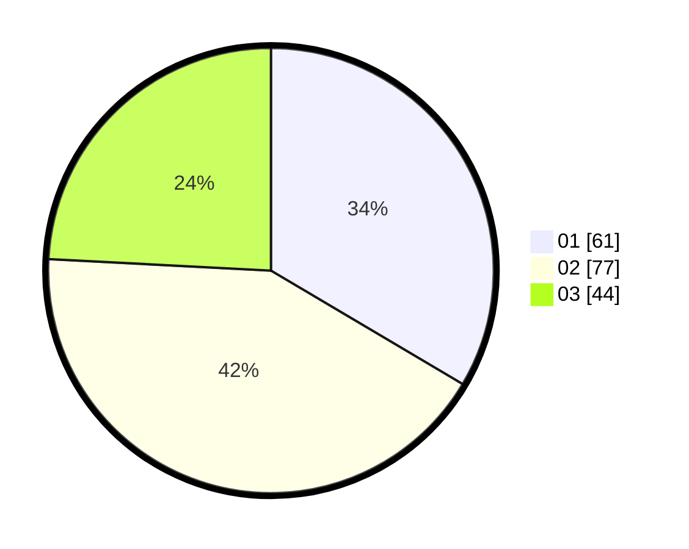

# Hasil

Hasil perolehan suara paslon dapat dilihat pada file paslon-01.txt, paslon-02.txt, dan paslon-03.txt.

Jika tidak ada, artinya data tersebut belum ada pada SIREKAP.

## Perolehan Suara

 * Paslon 01: **61**.
 * Paslon 02: **77**.
 * Paslon 03: **44**.

## Foto C Plano

https://sirekap-obj-formc.kpu.go.id/0354/pemilu/ppwp/31/73/04/10/06/3173041006055-20240214-204744--cba7eaed-f5b2-402c-9a84-91703067f273.jpg

https://sirekap-obj-formc.kpu.go.id/0354/pemilu/ppwp/31/73/04/10/06/3173041006055-20240214-200711--613d5a4c-1e3a-44dd-86fe-5366cb7300d9.jpg

https://sirekap-obj-formc.kpu.go.id/0354/pemilu/ppwp/31/73/04/10/06/3173041006055-20240214-190812--6af76fc7-87c1-458a-8a0a-82e161cddad6.jpg
