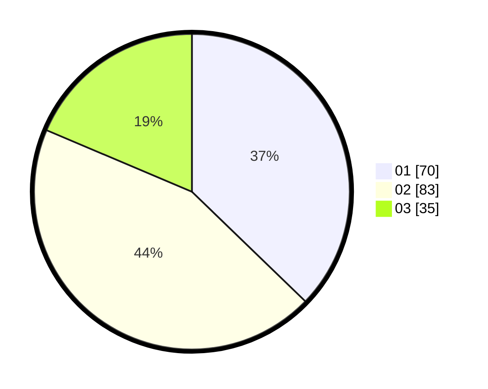

# Hasil

Hasil perolehan suara paslon dapat dilihat pada file paslon-01.txt, paslon-02.txt, dan paslon-03.txt.

Jika tidak ada, artinya data tersebut belum ada pada SIREKAP.

## Perolehan Suara

 * Paslon 01: **70**.
 * Paslon 02: **83**.
 * Paslon 03: **35**.

## Foto C Plano

https://sirekap-obj-formc.kpu.go.id/db6f/pemilu/ppwp/31/73/04/10/06/3173041006056-20240215-021846--5901ad4e-2b0a-4be8-86d0-8ceeaf60dbe4.jpg

https://sirekap-obj-formc.kpu.go.id/db6f/pemilu/ppwp/31/73/04/10/06/3173041006056-20240215-021919--b4d2749c-e6f0-4656-be1a-b4fc57a73f3b.jpg

https://sirekap-obj-formc.kpu.go.id/db6f/pemilu/ppwp/31/73/04/10/06/3173041006056-20240215-022251--5a892944-dab9-4aa5-ae4b-72f65dc09ab3.jpg
