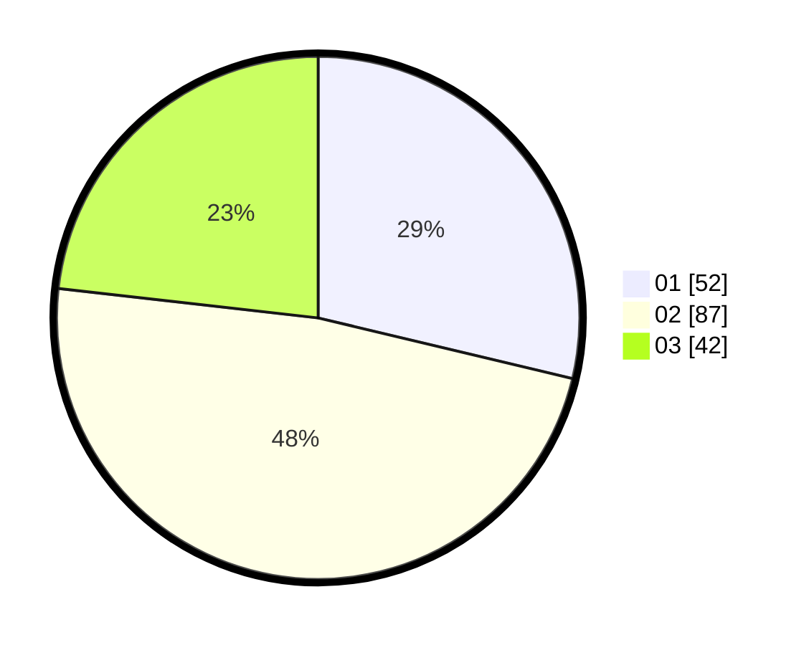

# Hasil

Hasil perolehan suara paslon dapat dilihat pada file paslon-01.txt, paslon-02.txt, dan paslon-03.txt.

Jika tidak ada, artinya data tersebut belum ada pada SIREKAP.

## Perolehan Suara

 * Paslon 01: **52**.
 * Paslon 02: **87**.
 * Paslon 03: **42**.

## Foto C Plano

https://sirekap-obj-formc.kpu.go.id/af03/pemilu/ppwp/31/73/04/10/06/3173041006057-20240214-230635--7280df8c-b227-4935-bcb0-afa142b4a4e9.jpg

https://sirekap-obj-formc.kpu.go.id/af03/pemilu/ppwp/31/73/04/10/06/3173041006057-20240214-230536--cd7d6b55-44c3-4807-bd1a-4e1e38cda270.jpg

https://sirekap-obj-formc.kpu.go.id/af03/pemilu/ppwp/31/73/04/10/06/3173041006057-20240214-230627--a21dcf79-df37-4fc7-8756-677a8fdbd644.jpg
