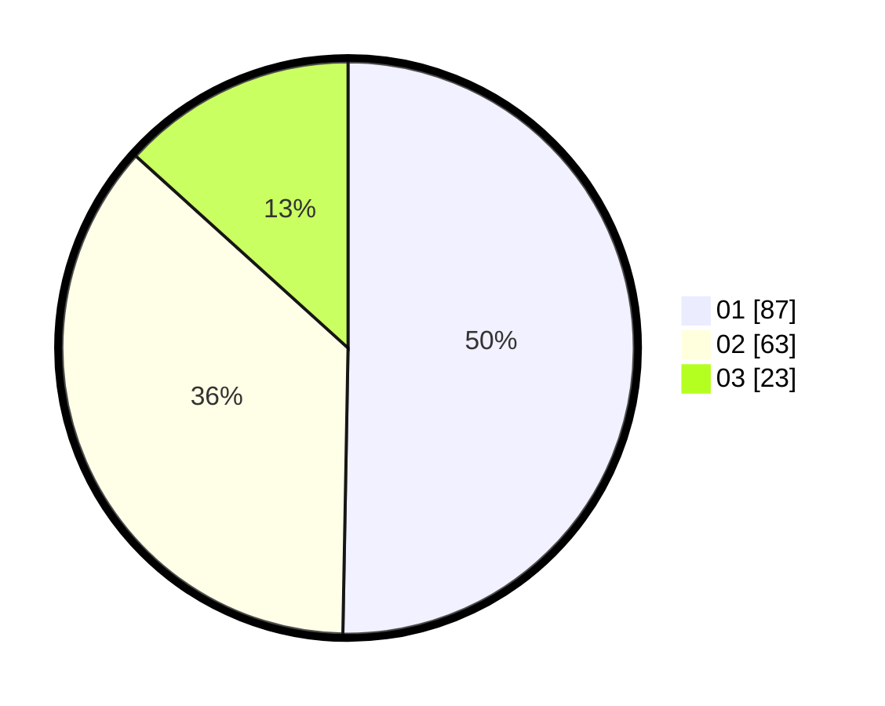

# Hasil

Hasil perolehan suara paslon dapat dilihat pada file paslon-01.txt, paslon-02.txt, dan paslon-03.txt.

Jika tidak ada, artinya data tersebut belum ada pada SIREKAP.

## Perolehan Suara

 * Paslon 01: **87**.
 * Paslon 02: **63**.
 * Paslon 03: **23**.

## Foto C Plano

https://sirekap-obj-formc.kpu.go.id/cc94/pemilu/ppwp/31/73/04/10/06/3173041006058-20240214-223605--388dea3e-96eb-48c1-a723-96d010763ae5.jpg

https://sirekap-obj-formc.kpu.go.id/cc94/pemilu/ppwp/31/73/04/10/06/3173041006058-20240214-223756--0aa6e64a-2aa7-4510-9cef-6fda36691b3e.jpg

https://sirekap-obj-formc.kpu.go.id/cc94/pemilu/ppwp/31/73/04/10/06/3173041006058-20240214-223926--bb012980-659e-4a39-9c61-c36beef18196.jpg
