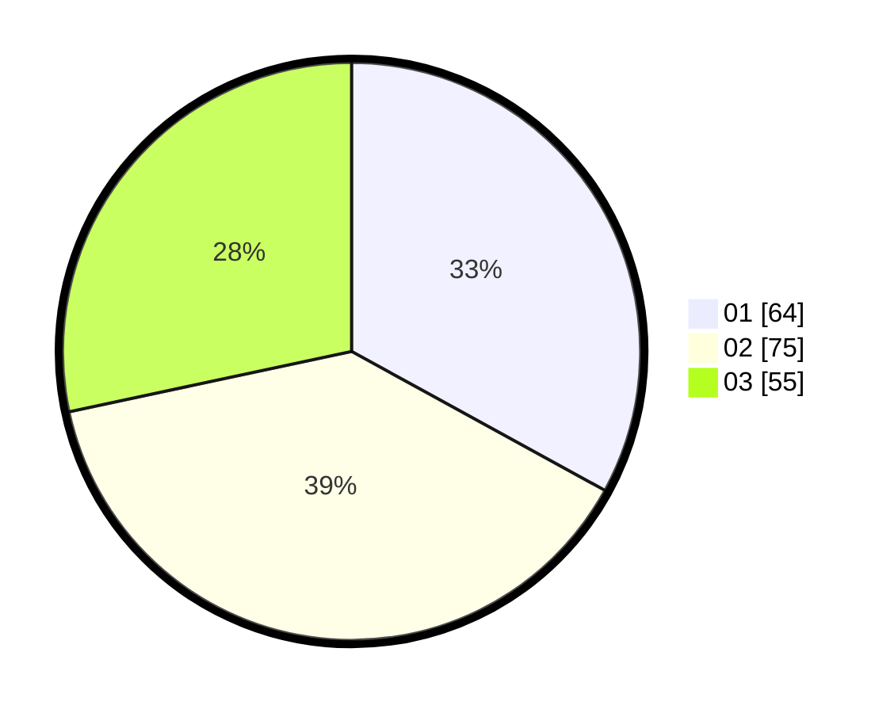

# Hasil

Hasil perolehan suara paslon dapat dilihat pada file paslon-01.txt, paslon-02.txt, dan paslon-03.txt.

Jika tidak ada, artinya data tersebut belum ada pada SIREKAP.

## Perolehan Suara

 * Paslon 01: **64**.
 * Paslon 02: **75**.
 * Paslon 03: **55**.

## Foto C Plano

https://sirekap-obj-formc.kpu.go.id/e928/pemilu/ppwp/31/73/04/10/06/3173041006061-20240214-160158--1e998562-588f-468d-afc9-46939bf31711.jpg

https://sirekap-obj-formc.kpu.go.id/e928/pemilu/ppwp/31/73/04/10/06/3173041006061-20240214-190515--d162b2a4-2b58-4714-b4ce-57ee72281f8e.jpg

https://sirekap-obj-formc.kpu.go.id/e928/pemilu/ppwp/31/73/04/10/06/3173041006061-20240214-155357--3d6b93ae-914a-478e-b584-412fb548b3c1.jpg

## DATA PEMILIH TETAP

Jumlah pemilih dalam DPT: **252**.
 * L: **137**.
 * P: **115**.

## DATA PENGGUNA HAK PILIH

Jumlah pengguna hak pilih dalam DPT: **189**.
 * L: **103**.
 * P: **86**.

Jumlah pengguna hak pilih dalam DPTb: **5**.
 * L: **2**.
 * P: **3**.

Jumlah pengguna hak pilih dalam DPK: **1**.
 * L: **0**.
 * P: **1**.

Jumlah pengguna hak pilih: **195**.
 * L: **103**.
 * P: **86**.

## JUMLAH SUARA SAH DAN TIDAK SAH

JUMLAH SELURUH SUARA SAH: **194**.

JUMLAH SUARA TIDAK SAH: **1**.

JUMLAH SELURUH SUARA SAH DAN SUARA TIDAK SAH: **194**.
