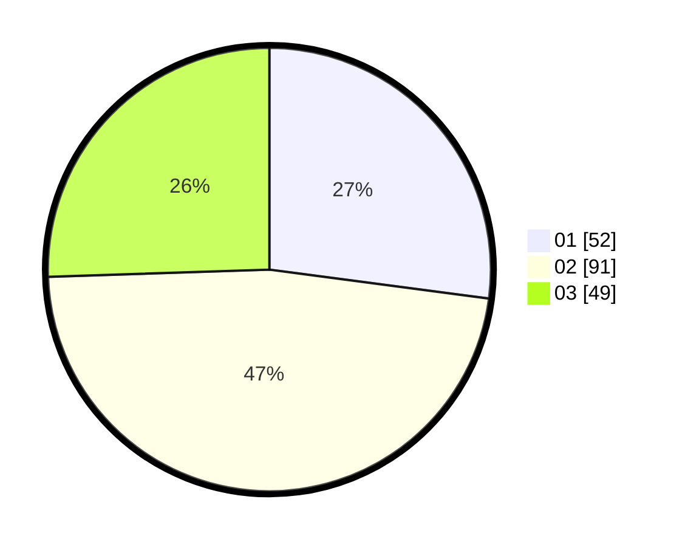

# Hasil

Hasil perolehan suara paslon dapat dilihat pada file paslon-01.txt, paslon-02.txt, dan paslon-03.txt.

Jika tidak ada, artinya data tersebut belum ada pada SIREKAP.

## Perolehan Suara

 * Paslon 01: **52**.
 * Paslon 02: **91**.
 * Paslon 03: **49**.

## Foto C Plano

https://sirekap-obj-formc.kpu.go.id/95d5/pemilu/ppwp/31/73/04/10/06/3173041006063-20240214-210848--5b799987-e4c3-4db5-b067-f367ee90334f.jpg

https://sirekap-obj-formc.kpu.go.id/95d5/pemilu/ppwp/31/73/04/10/06/3173041006063-20240214-211149--83d85075-fcf0-46da-bed4-5c3c549444fb.jpg

https://sirekap-obj-formc.kpu.go.id/95d5/pemilu/ppwp/31/73/04/10/06/3173041006063-20240214-211345--46e5023f-2ecb-4c34-a537-5069a5b27f3c.jpg
